### **Giải thích Sơ đồ Tuần Tự Hóa và Toàn Bộ Hệ Thống cho Principal Staff Engineer**

---

#### **1. Tổng quan về hệ thống**

Hệ thống binary của Cục Cảnh sát quản lý hành chính về trật tự xã hội được thiết kế để quản lý thông tin công dân, hồ sơ hành chính và các tác vụ liên quan đến quản lý nhà nước. Mục tiêu chính của hệ thống là đảm bảo tính bảo mật cao, quản lý chặt chẽ các quyền truy cập, ghi log mọi hoạt động để duy trì tính minh bạch và khả năng kiểm tra, cũng như tối ưu hóa hiệu suất và khả năng mở rộng của hệ thống.

#### **2. Cấu trúc và thành phần của hệ thống**

Hệ thống bao gồm các thành phần chính sau:

- **User (Người dùng):** Đầu vào của hệ thống, có thể là công dân hoặc cán bộ quản lý thực hiện yêu cầu.
- **WPA (Workflow Processing Agent):** Thành phần chịu trách nhiệm xử lý toàn bộ yêu cầu từ người dùng, bao gồm xác thực, mã hóa, xử lý dữ liệu, và quản lý sự kiện.
- **Eventable, Queueable:** Hệ thống quản lý sự kiện, giúp xử lý các sự kiện một cách tuần tự và có thể theo dõi.
- **Citizen, Record:** Các cấu trúc đại diện cho thông tin công dân và hồ sơ hành chính, bao gồm mã hóa và quản lý trạng thái.
- **Chief, Deputy, Officer:** Các vai trò quản lý trong hệ thống, với các quyền và chức năng được phân cấp rõ ràng.
- **Database:** Cơ sở dữ liệu để lưu trữ và quản lý thông tin được xử lý.
- **Notification System:** Hệ thống thông báo, gửi thông báo về kết quả xử lý cho người dùng.

#### **3. Sơ đồ tuần tự hóa chi tiết**

Sơ đồ tuần tự hóa mô tả chi tiết cách thức các thành phần trong hệ thống tương tác với nhau từ lúc tiếp nhận yêu cầu cho đến khi hoàn tất xử lý và gửi phản hồi cho người dùng. Dưới đây là các bước chi tiết:

1. **USER gửi yêu cầu đến WPA (Workflow Processing Agent):**
   - Người dùng gửi một yêu cầu, chẳng hạn như đăng ký, tìm kiếm thông tin, hoặc chỉnh sửa hồ sơ.

2. **WPA thực hiện các bước xử lý:**
   - **Loggable:** Ghi lại yêu cầu vào log để đảm bảo mọi hành động đều có thể kiểm tra.
   - **Validatable:** Xác thực yêu cầu để đảm bảo dữ liệu hợp lệ.
   - **Deduplicatable:** Loại bỏ các yêu cầu trùng lặp để tránh xử lý thừa.
   - **Sanitizable:** Làm sạch dữ liệu yêu cầu trước khi xử lý, đảm bảo không có dữ liệu không hợp lệ hoặc nguy hiểm.
   - **Authenticatable:** Xác thực người dùng bằng các phương thức như mật khẩu hoặc xác thực hai bước (OTP).
   - **Prioritizable:** Xác định mức độ ưu tiên của yêu cầu để xử lý nhanh hơn các yêu cầu quan trọng.
   - **Filterable:** Lọc dữ liệu dựa trên các tiêu chí đã định.
   - **Searchable:** Tìm kiếm và truy xuất dữ liệu liên quan từ cơ sở dữ liệu.
   - **Indexable:** Lập chỉ mục dữ liệu để tăng tốc độ truy xuất.
   - **Serializable:** Chuyển dữ liệu thành dạng tuần tự để dễ dàng lưu trữ hoặc truyền tải.
   - **Encryptable:** Mã hóa dữ liệu nhạy cảm để bảo vệ thông tin.
   - **Compressable:** Nén dữ liệu để tiết kiệm không gian và tăng tốc độ truyền tải.
   - **Cachable:** Lưu trữ yêu cầu tạm thời trong bộ nhớ đệm để xử lý nhanh hơn trong tương lai.
   - **Trackable:** Theo dõi tiến trình xử lý yêu cầu để đảm bảo không bị gián đoạn.
   - **Throttlable:** Điều chỉnh tốc độ xử lý để tránh quá tải hệ thống.
   - **Scalable:** Điều chỉnh tài nguyên hệ thống theo nhu cầu xử lý.
   - **Observable:** Quan sát quá trình xử lý để phát hiện và giải quyết sự cố kịp thời.
   - **Timeoutable:** Đặt giới hạn thời gian cho quá trình xử lý yêu cầu để tránh bị treo.
   - **Reversible:** Cho phép hoàn tác yêu cầu nếu có lỗi hoặc yêu cầu bị hủy bỏ.
   - **Recoverable:** Khả năng phục hồi từ lỗi để đảm bảo tính liên tục của hệ thống.
   - **Persistable:** Lưu trữ trạng thái yêu cầu để đảm bảo dữ liệu không bị mất trong quá trình xử lý.

3. **WPA đăng ký sự kiện và đưa vào hàng đợi (Eventable, Queueable):**
   - Sự kiện liên quan đến yêu cầu được đăng ký và đưa vào hàng đợi để xử lý theo thứ tự.

4. **WPA xử lý dữ liệu công dân và hồ sơ (Citizen, Record):**
   - Dữ liệu công dân và hồ sơ được mã hóa và giải mã để bảo mật thông tin trong quá trình xử lý.

5. **Cập nhật Cơ sở dữ liệu (Database):**
   - Sau khi xử lý, thông tin được cập nhật vào cơ sở dữ liệu để lưu trữ và quản lý.

6. **Thông báo và xử lý bởi các vai trò (Chief, Deputy, Officer):**
   - **Chief** nhận thông báo và thực hiện các hành động như phê duyệt hoặc từ chối yêu cầu.
   - **Deputy** xử lý các bước tiếp theo sau khi Chief đã xử lý xong.
   - **Officer** nhận nhiệm vụ và thực hiện các hành động cần thiết theo quyền hạn được giao.

7. **Kết quả cuối cùng:**
   - **WPA** hoàn tất xử lý và gửi thông báo về kết quả cho **USER** thông qua **Notification System**.

#### **4. Tính năng bảo mật và quản lý phân quyền**

- **Mã hóa và giải mã (Encryptable, Decryptable):** Mọi dữ liệu nhạy cảm đều được mã hóa trước khi lưu trữ hoặc truyền tải, đảm bảo rằng thông tin không bị truy cập trái phép.
- **Xác thực nhiều lớp (Authenticatable):** Hệ thống sử dụng xác thực hai bước (mật khẩu và OTP) để đảm bảo chỉ người dùng hợp lệ mới có thể truy cập.
- **Quản lý phân quyền (Grantable):** Các vai trò như Chief, Deputy, và Officer được phân quyền rõ ràng, chỉ cho phép họ thực hiện các tác vụ phù hợp với quyền hạn của mình.
- **Ghi log và kiểm tra (Loggable, Auditable):** Mọi hành động trong hệ thống đều được ghi log và có thể kiểm tra lại để đảm bảo tính minh bạch và khả năng truy xuất.

#### **5. Khả năng mở rộng và tối ưu hóa**

- **Scalable:** Hệ thống có khả năng mở rộng linh hoạt, đáp ứng tốt nhu cầu xử lý dữ liệu lớn và nhiều người dùng đồng thời.
- **Throttlable:** Điều chỉnh tải hệ thống để tránh tình trạng quá tải, đảm bảo hệ thống luôn hoạt động ổn định.
- **Configurable, Customizable:** Hệ thống có thể cấu hình và tùy chỉnh dễ dàng để đáp ứng các nhu cầu đặc thù của các phòng ban và quản lý.

Dưới đây là bản cập nhật của sơ đồ tuần tự hóa để phản ánh đầy đủ các cấu trúc và mã nguồn mới đã được tích hợp và triển khai trong hệ thống binary của Cục Cảnh sát quản lý hành chính về trật tự xã hội.

```mermaid
sequenceDiagram
    participant USER as User
    participant WPA as Workflow Processing Agent
    participant Eventable as Eventable<Subscriber, Publisher>
    participant Queueable as Queueable<Event>
    participant Citizen as Citizen
    participant Record as Record
    participant Chief as Chief
    participant Deputy as Deputy
    participant Officer as Officer
    participant Database as Database
    participant Notification as Notification System
    participant Encryptable as Encryptable
    participant Decryptable as Decryptable
    participant Loggable as Loggable
    participant Validatable as Validatable
    participant Deduplicatable as Deduplicatable
    participant Sanitizable as Sanitizable
    participant Authenticatable as Authenticatable
    participant Prioritizable as Prioritizable
    participant Filterable as Filterable
    participant Searchable as Searchable
    participant Indexable as Indexable
    participant Serializable as Serializable
    participant Deserializable as Deserializable
    participant Compressable as Compressable
    participant Decompressable as Decompressable
    participant Cachable as Cachable
    participant Trackable as Trackable
    participant Throttlable as Throttlable
    participant Scalable as Scalable
    participant Observable as Observable
    participant Timeoutable as Timeoutable
    participant Reversible as Reversible
    participant Recoverable as Recoverable
    participant Persistable as Persistable
    participant Auditable as Auditable
    participant Configurable as Configurable
    participant Extendable as Extendable
    participant Aggregatable as Aggregatable
    participant Customizable as Customizable
    participant Modularizable as Modularizable
    participant Governable as Governable
    participant Isolatable as Isolatable
    participant Traceable as Traceable
    participant Notifiable as Notifiable
    participant Schedulable as Schedulable
    participant Redactable as Redactable
    participant Notarizable as Notarizable
    participant Verifiable as Verifiable
    participant Archivable as Archivable
    participant Attachable as Attachable
    participant Visualizable as Visualizable
    participant Replicable as Replicable
    participant Expandable as Expandable

    USER->>WPA: Send request to WPA
    WPA->>Loggable: Log request (Loggable)
    WPA->>Validatable: Validate request (Validatable)
    WPA->>Deduplicatable: Deduplicate request (Deduplicatable)
    WPA->>Sanitizable: Sanitize data (Sanitizable)
    WPA->>Authenticatable: Authenticate user (Authenticatable)
    WPA->>Prioritizable: Prioritize request (Prioritizable)
    WPA->>Filterable: Apply filters to request data (Filterable)
    WPA->>Searchable: Search and retrieve related data (Searchable)
    WPA->>Indexable: Index data for fast access (Indexable)
    WPA->>Serializable: Serialize request data (Serializable)
    WPA->>Encryptable: Encrypt data (Encryptable)
    WPA->>Compressable: Compress data (Compressable)
    WPA->>Cachable: Cache request (Cachable)
    WPA->>Trackable: Track request (Trackable)
    WPA->>Throttlable: Throttle request (Throttlable)
    WPA->>Scalable: Scale resources as needed (Scalable)
    WPA->>Observable: Observe process (Observable)
    WPA->>Timeoutable: Set timeout for request (Timeoutable)
    WPA->>Reversible: Reverse request if needed (Reversible)
    WPA->>Recoverable: Recover from errors (Recoverable)
    WPA->>Persistable: Persist request state (Persistable)
    WPA->>Eventable: Register Event (Eventable<Subscriber, Publisher>)
    Eventable->>Queueable: Queue Event (Queueable<Event>)
    Queueable->>Monitorable: Monitor Event processing (Monitorable)
    Queueable->>Resumable: Resume Event processing (Resumable)
    Queueable->>WPA: Dequeue Event
    WPA->>Citizen: Process Citizen data (Encryptable, Decryptable)
    WPA->>Record: Process Record data (Encryptable, Decryptable)
    WPA->>Database: Save state and update records
    Database-->>WPA: Return processing result
    WPA->>Chief: Notify Chief for approval (Notifiable)
    Chief->>Loggable: Log approval action (Loggable)
    Chief->>Database: Update approval status in Database
    WPA->>Deputy: Notify Deputy for further processing (Notifiable)
    Deputy->>Loggable: Log deputy action (Loggable)
    Deputy->>Database: Update status in Database
    WPA->>Officer: Assign tasks to Officer (Schedulable)
    Officer->>Loggable: Log officer actions (Loggable)
    Officer->>Database: Update officer tasks in Database
    WPA->>Notification: Publish final notification to user
    Notification-->>USER: Notify User of Success
```

#### **6. Kết luận**

Hệ thống binary của Cục Cảnh sát quản lý hành chính về trật tự xã hội được thiết kế với một kiến trúc bảo mật cao, quản lý chặt chẽ các quyền truy cập và khả năng theo dõi toàn diện mọi hành động. Với các thành phần và logic đã triển khai, hệ thống này không chỉ đáp ứng tốt các yêu cầu nghiệp vụ mà còn đảm bảo tính an toàn và hiệu suất cao, sẵn sàng cho việc mở rộng và tích hợp thêm các tính năng mới trong tương lai.