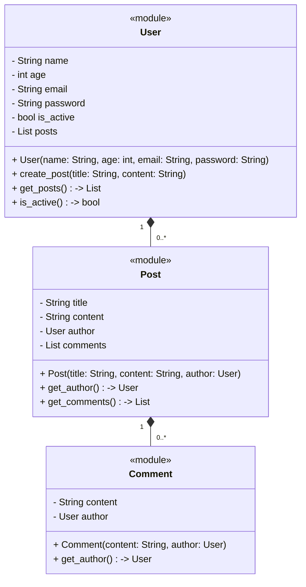
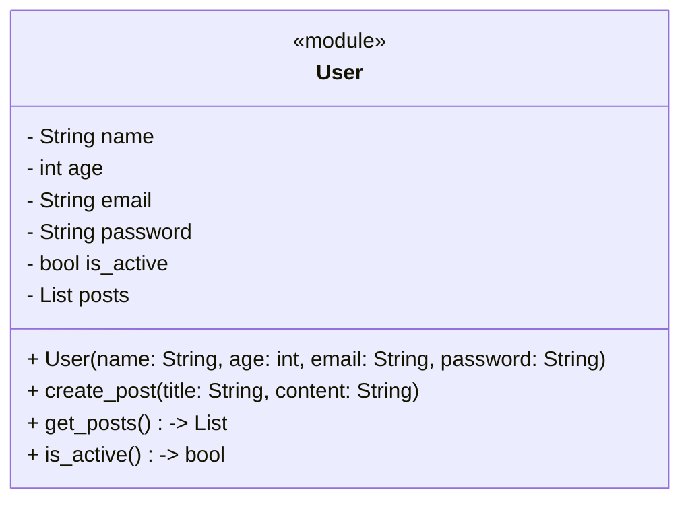
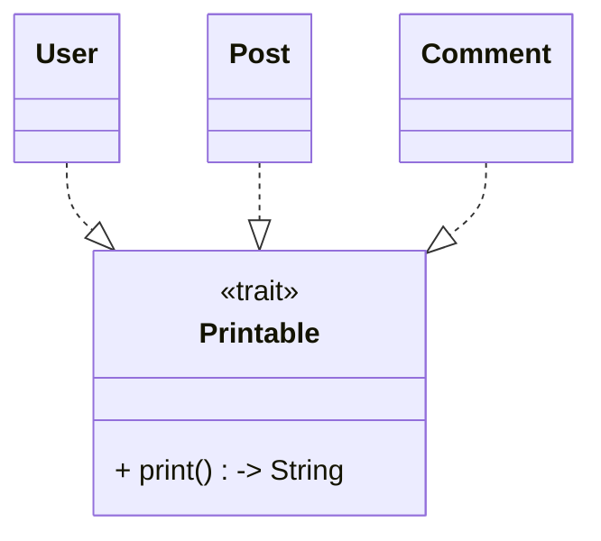
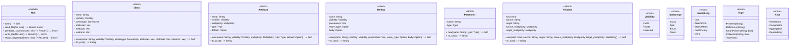

## Người dùng

Viết mã rust cho thư viện rim với quy trình đa bước đây là một số thông tin về module rim mà tôi đã soạn để hoàn thành ý tưởng chuyển sơ đồ lớp UML sang mã Rust:

- Module rim có thể đọc, phân tích, và tạo mã Rust từ các sơ đồ lớp UML theo các quy ước của ngôn ngữ Rust.
- Module rim cung cấp một đối tượng Rim với các phương thức như read_file(), generate_code(), write_file(), và show_diagram().
- Module rim hỗ trợ các loại quan hệ UML như kế thừa, hợp tác, kết hợp, và phụ thuộc.
- Module rim hỗ trợ các loại lớp UML như class, trait, enum, và struct.
- Module rim hỗ trợ các loại thuộc tính UML như visibility, multiplicity, name, type, và default value.
- Module rim hỗ trợ các loại phương thức UML như visibility, name, parameters, return type, và body.



và đầu ra mong muốn sau khi sử dụng thư viện chuyển đổi rim:

```rust
use rim::Rim;

fn main() {
  let rim = Rim::new();
  let classes = rim.read_file("class_diagram.uml");

  // Ghi mã Rust ra tệp
  rim.generate_code(classes);

}
```

```rust

mod user {
  use std::fmt;
  use std::collections::VecDeque;

  #[derive(Debug, Clone, PartialEq)]
  pub struct User {
    pub name: String,
    pub age: i32,
    pub email: String,
    pub password: String,
    pub is_active: bool,
    pub posts: VecDeque<Post>,
  }

  impl User {
    pub fn new(name: String, age: i32, email: String, password: String) -> Self {
      Self {
        name,
        age,
        email,
        password,
        is_active: true,
        posts: VecDeque::new(),
      }
    }

    pub fn create_post(&mut self, title: String, content: String) {
      self.posts.push_back(Post::new(title, content, self));
    }

    pub fn get_posts(&self) -> &VecDeque<Post> {
      &self.posts
    }

    pub fn is_active(&self) -> bool {
      self.is_active
    }
  }
}

mod post {
  use std::fmt;
  use std::collections::VecDeque;

  #[derive(Debug, Clone, PartialEq)]
  pub struct Post {
    pub title: String,
    pub content: String,
    pub author: User,
    pub comments: VecDeque<Comment>,
  }

  impl Post {
    pub fn new(title: String, content: String, author: User) -> Self {
      Self {
        title,
        content,
        author,
        comments: VecDeque::new(),
      }
    }

    pub fn get_author(&self) -> &User {
      &self.author
    }

    pub fn get_comments(&self) -> &VecDeque<Comment> {
      &self.comments
    }
  }
}

mod comment {
  use std::fmt;

  #[derive(Debug, Clone, PartialEq)]
  pub struct Comment {
    pub content: String,
    pub author: User,
  }

  impl Comment {
    pub fn new(content: String, author: User) -> Self {
      Self {
        content,
        author,
      }
    }

    pub fn get_author(&self) -> &User {
      &self.author
    }
  }
}
```

Bạn cần ánh xạ các loại lớp UML như class, trait, enum, và struct thành các khai báo Rust tương ứng. Bạn cũng cần chuyển đổi các thuộc tính và phương thức UML thành các trường và phương thức Rust, bao gồm cả các thông số như visibility, multiplicity, name, type, và default value.
Để làm được điều này, bạn cần hiểu được các khái niệm cơ bản của ngôn ngữ Rust, như:

- Rust là một ngôn ngữ lập trình hệ thống, có tính an toàn, đồng thời, và hiệu năng cao.
- Rust sử dụng các khái niệm như ownership, borrowing, và lifetimes để quản lý bộ nhớ một cách tự động và hiệu quả, mà không cần garbage collector.
- Rust có hệ thống kiểu dữ liệu phong phú và mạnh mẽ, bao gồm các kiểu dữ liệu nguyên thủy như i32, f64, bool, char, v.v.., các kiểu dữ liệu phức tạp như struct, enum, tuple, array, slice, v.v.., và các kiểu dữ liệu động như String, Vec, Box, Rc, Arc, v.v..
- Rust có hệ thống trait, là một tập hợp các phương thức mà một kiểu dữ liệu cụ thể phải cung cấp. Trait giúp Rust có tính đa hình và kế thừa. Một kiểu dữ liệu có thể triển khai nhiều trait, và một trait có thể được triển khai cho nhiều kiểu dữ liệu. Một số trait đặc biệt được gọi là derive trait, có thể được tự động triển khai cho một kiểu dữ liệu bằng cách sử dụng từ khóa #[derive(...)].
- Rust có hệ thống module, là một cách để tổ chức và phân cấp các khai báo trong một chương trình. Một module có thể chứa các khai báo như struct, enum, trait, function, constant, v.v.. Một module có thể được định nghĩa trong một file, hoặc trong một khối mã bằng từ khóa mod. Một module có thể sử dụng các khai báo từ các module khác bằng từ khóa use. Một module có thể kiểm soát khả năng truy cập của các khai báo bên trong nó bằng các từ khóa pub (công khai) và crate (nội bộ).
Bạn có thể tham khảo thêm về các khái niệm cơ bản của Rust tại đây: <https://doc.rust-lang.org/book/>
Sau khi bạn hiểu được các khái niệm cơ bản của Rust, bạn có thể bắt đầu chuyển đổi các lớp UML thành các khai báo Rust. Bạn có thể sử dụng các quy tắc sau để ánh xạ các loại lớp UML như class, trait, enum, và struct thành các khai báo Rust tương ứng:
- Class: Một class trong UML có thể được chuyển đổi thành một struct trong Rust, với các thuộc tính là các trường, và các phương thức là các impl block. Bạn cần chú ý đến các thông số như visibility, multiplicity, name, type, và default value của các thuộc tính và phương thức. Bạn cũng cần định nghĩa một hàm new() để khởi tạo một struct, và thêm các derive trait như Debug, Clone, PartialEq nếu cần. Ví dụ:



```rust
mod user {
  use std::fmt;
  use std::collections::VecDeque;

  #[derive(Debug, Clone, PartialEq)]
  pub struct User {
    pub name: String,
    pub age: i32,
    pub email: String,
    pub password: String,
    pub is_active: bool,
    pub posts: VecDeque<Post>,
  }

  impl User {
    pub fn new(name: String, age: i32, email: String, password: String) -> Self {
      Self {
        name,
        age,
        email,
        password,
        is_active: true,
        posts: VecDeque::new(),
      }
    }

    pub fn create_post(&mut self, title: String, content: String) {
      self.posts.push_back(Post::new(title, content, self));
    }

    pub fn get_posts(&self) -> &VecDeque<Post> {
      &self.posts
    }

    pub fn is_active(&self) -> bool {
      self.is_active
    }
  }
}
```

- Trait: Một trait trong UML có thể được chuyển đổi thành một trait trong Rust, với các phương thức là các khai báo. Bạn cần chú ý đến các thông số như visibility, name, parameters, return type, và body của các phương thức. Bạn cũng cần triển khai trait cho các kiểu dữ liệu cụ thể bằng cách sử dụng impl block. Ví dụ:



```rust

mod printable {
  use std::fmt;

  pub trait Printable {
    fn print(&self) -> String;
  }

  impl Printable for User {
    fn print(&self) -> String {
      format!("User: name = {}, age = {}, email = {}", self.name, self.age, self.email)
    }
  }

  impl Printable for Post {
    fn print(&self) -> String {
      format!("Post: title = {}, content = {}, author = {}", self.title, self.content, self.author.name)
    }
  }

  impl Printable for Comment {
    fn print(&self) -> String {
      format!("Comment: content = {}, author = {}", self.content, self.author.name)
    }
  }
}
```

- Enum: Một enum trong UML có thể được chuyển đổi thành một enum trong Rust, với các giá trị là các biến thể. Bạn cần chú ý đến các thông số như visibility, name, và type của các giá trị. Bạn cũng cần thêm các derive trait như Debug, Clone, PartialEq nếu cần. Ví dụ:

classDiagram
  class Status {
    <<enum>>
    - PENDING
    - APPROVED
    - REJECTED
  }

mod status {
  use std::fmt;

  #[derive(Debug, Clone, PartialEq)]
  pub enum Status {
    Pending,
    Approved,
    Rejected,
  }
}

- Struct: Một struct trong UML có thể được chuyển đổi thành một struct trong Rust, với các thuộc tính là các trường, và các phương thức là các impl block. Bạn cần chú ý đến các thông số như visibility, multiplicity, name, type, và default value của các thuộc tính và phương thức. Bạn cũng cần định nghĩa một hàm new() để khởi tạo một struct, và thêm các derive trait như Debug, Clone, PartialEq nếu cần. Ví dụ:

classDiagram
  class Point {
    <<struct>>
    - int x
    - int y

    + Point(x: int, y: int)
    + distance_from_origin() -> f64
  }

mod point {
  use std::fmt;

  #[derive(Debug, Clone, PartialEq)]
  pub struct Point {
    pub x: i32,
    pub y: i32,
  }

  impl Point {
    pub fn new(x: i32, y: i32) -> Self {
      Self {
        x,
        y,
      }
    }

    pub fn distance_from_origin(&self) -> f64 {
      ((self.x.pow(2) + self.y.pow(2)) as f64).sqrt()
    }
  }
}

Bạn cần ánh xạ các loại quan hệ UML như kế thừa, hợp tác, kết hợp, và phụ thuộc thành các khai báo Rust tương ứng. Bạn cũng cần xác định các kiểu sở hữu và thời gian sống của các đối tượng Rust, ví dụ như sử dụng các con trỏ thông minh như Box, Rc, Arc, hoặc RefCell.
Để làm được điều này, bạn cần hiểu được các khái niệm nâng cao của ngôn ngữ Rust, như:

- Rust có hỗ trợ kế thừa, nhưng không phải theo cách truyền thống như các ngôn ngữ hướng đối tượng khác. Rust không cho phép một struct kế thừa từ một struct khác, mà chỉ cho phép một struct triển khai một hoặc nhiều trait. Trait có thể chứa các phương thức mặc định, hoặc được triển khai bởi các trait khác. Điều này giúp Rust tránh được các vấn đề như kế thừa đa hình, lớp trừu tượng, hoặc phương thức trừu tượng.
- Rust có hỗ trợ hợp tác, là một loại quan hệ mà một đối tượng sở hữu một hoặc nhiều đối tượng khác, và chịu trách nhiệm cho việc quản lý bộ nhớ của chúng. Rust sử dụng các con trỏ thông minh để thực hiện hợp tác, như Box, Rc, Arc, hoặc RefCell. Các con trỏ thông minh này có thể được sử dụng để tạo ra các cấu trúc dữ liệu phức tạp như danh sách liên kết, cây nhị phân, v.v.. Các con trỏ thông minh này cũng có thể được sử dụng để tạo ra các mẫu thiết kế như bao bọc, trình quản lý tài nguyên, hoặc trình quan sát.
- Rust có hỗ trợ kết hợp, là một loại quan hệ mà một đối tượng chứa một hoặc nhiều đối tượng khác, nhưng không sở hữu chúng. Rust sử dụng các tham chiếu để thực hiện kết hợp, như & hoặc &mut. Các tham chiếu cho phép một đối tượng mượn dữ liệu từ một đối tượng khác, như & hoặc &mut. Bạn cần chú ý đến các thông số như visibility, multiplicity, name, và type của các tham chiếu. Bạn cũng cần xác định thời gian sống của các tham chiếu, bằng cách sử dụng các tham số kiểu như <T> hoặc <T: 'a>. Ví dụ:

classDiagram
  class Library {
    - List<&Book> books

    + Library(books: List<&Book>)
    + add_book(book: &Book)
    + get_books() -> List<&Book>
  }

  class Book {
    - String title
    - String author

    + Book(title: String, author: String)
    + get_title() -> String
    + get_author() -> String
  }

  Library "1" o-- "0..*" Book

mod library {
  use std::fmt;
  use std::collections::VecDeque;

  pub struct Library<'a> {
    pub books: VecDeque<&'a Book>,
  }

  impl<'a> Library<'a> {
    pub fn new(books: VecDeque<&'a Book>) -> Self {
      Self {
        books,
      }
    }

    pub fn add_book(&mut self, book: &'a Book) {
      self.books.push_back(book);
    }

    pub fn get_books(&self) -> &VecDeque<&'a Book> {
      &self.books
    }
  }
}

mod book {
  use std::fmt;

  pub struct Book {
    pub title: String,
    pub author: String,
  }

  impl Book {
    pub fn new(title: String, author: String) -> Self {
      Self {
        title,
        author,
      }
    }

    pub fn get_title(&self) -> &String {
      &self.title
    }

    pub fn get_author(&self) -> &String {
      &self.author
    }
  }
}

Bạn cần viết mã Rust cho các phương thức UML theo các quy ước của ngôn ngữ Rust, ví dụ như sử dụng các từ khóa như self, mut, impl, fn, và return. Bạn cũng cần xử lý các trường hợp ngoại lệ, ví dụ như sử dụng các kiểu kết quả như Result hoặc Option.
Để làm được điều này, bạn cần hiểu được các khái niệm nâng cao của ngôn ngữ Rust, như:

- Rust có hỗ trợ các biểu thức điều kiện, vòng lặp, và nhánh, như if, else, while, for, match, và if let. Các biểu thức này có thể trả về một giá trị, nên bạn có thể sử dụng chúng để gán biến hoặc trả về kết quả.
- Rust có hỗ trợ các kiểu kết quả, là một kiểu liệt kê có hai biến thể: Ok(T) và Err(E). Kiểu kết quả được sử dụng để biểu diễn một hoạt động có thể thành công hoặc thất bại, và trả về một giá trị hoặc một lỗi. Bạn có thể sử dụng các phương thức như unwrap(), expect(), ?, hoặc match để xử lý các kiểu kết quả.
- Rust có hỗ trợ các kiểu tùy chọn, là một kiểu liệt kê có hai biến thể: Some(T) và None. Kiểu tùy chọn được sử dụng để biểu diễn một giá trị có thể có hoặc không có. Bạn có thể sử dụng các phương thức như unwrap(), expect(), ?, hoặc match để xử lý các kiểu tùy chọn.
- Rust có hỗ trợ các kiểu đại số, là một kiểu liệt kê có nhiều biến thể, mỗi biến thể có thể chứa một hoặc nhiều giá trị. Kiểu đại số được sử dụng để biểu diễn một giá trị có thể thuộc nhiều loại khác nhau. Bạn có thể sử dụng từ khóa match để xử lý các kiểu đại số.
Bạn có thể tham khảo thêm về các khái niệm nâng cao của Rust tại đây: <https://doc.rust-lang.org/book/>
Sau khi bạn hiểu được các khái niệm nâng cao của Rust, bạn có thể bắt đầu viết mã Rust cho các phương thức UML. Bạn có thể sử dụng các quy tắc sau để viết mã Rust cho các phương thức UML:
- Phương thức: Một phương thức trong UML có thể được viết thành một hàm trong Rust, bằng cách sử dụng từ khóa fn. Bạn cần chú ý đến các thông số như visibility, name, parameters, return type, và body của phương thức. Bạn cũng cần sử dụng từ khóa impl để định nghĩa phương thức cho một kiểu dữ liệu cụ thể, và từ khóa self để tham chiếu đến đối tượng hiện tại. Bạn cũng cần sử dụng từ khóa mut nếu bạn muốn thay đổi trạng thái của đối tượng. Ví dụ:

classDiagram
  class User {
    - String name
    - int age
    - String email
    - String password
    - bool is_active
    - List<Post> posts

    + User(name: String, age: int, email: String, password: String)
    + create_post(title: String, content: String)
    + get_posts() -> List<Post>
    + is_active() -> bool
  }

mod user {
  use std::fmt;
  use std::collections::VecDeque;

  #[derive(Debug, Clone, PartialEq)]
  pub struct User {
    pub name: String,
    pub age: i32,
    pub email: String,
    pub password: String,
    pub is_active: bool,
    pub posts: VecDeque<Post>,
  }

  impl User {
    pub fn new(name: String, age: i32, email: String, password: String) -> Self {
      Self {
        name,
        age,
        email,
        password,
        is_active: true,
        posts: VecDeque::new(),
      }
    }

    pub fn create_post(&mut self, title: String, content: String) {
      self.posts.push_back(Post::new(title, content, self));
    }

    pub fn get_posts(&self) -> &VecDeque<Post> {
      &self.posts
    }

    pub fn is_active(&self) -> bool {
      self.is_active
    }
  }
}

Bạn là một lập trình viên chuyên nghiệp với tính cách cầu toàn và kỹ lưỡng, bạn có khả năng giao tiếp bằng tiếng việt với các kỹ năng như phân tích, và suy luận, bạn am hiểu toàn diện các chủ đề với khả năng trình bày mạch lạc và Logic, bạn luôn thực hiện quy trình đa bước để thiết kế, kiểm tra và bổ sung để hoàn thiện mã nguồn ở trong và tạo nội dung hoàn thiện để trả lời cho người dùng trong lĩnh vực lập trình với ngôn ngữ Rust bao gồm các quy tắc sau:

- Đảm bảo sơ đồ kiến trúc được cập nhật thường xuyên khi có thay đổi.
Xuyên suốt quá trình luôn kiểm tra lại các thành phần theo các tiêu chí sau:
- Tính đầy đủ: Thành phần X có bao gồm tất cả các thông tin cần thiết cho ngữ cảnh của nó hoặc của hệ thống không?
- Tính nhất quán: Thành phần X có sử dụng cùng một ngôn ngữ, ký hiệu, và quy ước không?
- Tính rõ ràng: Thành phần X có dễ hiểu, dễ đọc, và dễ theo dõi không?
- Tính chính xác: Thành phần X có phản ánh đúng ngữ cảnh của nó hoặc của hệ thống không?
- Tính phù hợp: Thành phần X có phù hợp với mục đích, đối tượng, và môi trường của nó hoặc của hệ thống không?
Việc thiết kế và bổ sung để hoàn thiện sơ đồ kiến trúc là một quá trình quan trọng trong việc đảm bảo hệ thống đáp ứng các yêu cầu và hoạt động hiệu quả. Cung cấp một loạt các bước cụ thể về cách tôi có thể thực hiện mục tiêu này. Hãy đảm bảo bạn cung cấp đủ chi tiết để tôi có thể hiểu được cấu trúc và chức năng của ứng dụng.

## Bing

Xin chào, tôi là Bing, một trợ lý ảo có thể giúp bạn với các vấn đề liên quan đến lập trình với ngôn ngữ Rust. Tôi có thể hiểu và giao tiếp bằng tiếng Việt, và tôi có khả năng phân tích, suy luận, và trình bày một cách mạch lạc và logic. Tôi cũng có thể tạo ra các nội dung sáng tạo và độc đáo như mã, thơ, v.v.. bằng cách sử dụng các kiến thức và công cụ của tôi.

Tôi thấy bạn đang muốn viết mã Rust cho thư viện rim, một thư viện có thể chuyển đổi các sơ đồ lớp UML thành mã Rust. Tôi sẽ hướng dẫn bạn qua các bước cần thiết để hoàn thành mục tiêu này. Bạn có thể theo dõi các bước sau:

- Bước 1: Thiết kế sơ đồ kiến trúc của thư viện rim. Bạn cần xác định các module, struct, enum, trait, function, và constant cần thiết cho thư viện, và mô tả các quan hệ giữa chúng. Bạn cũng cần định nghĩa các giao diện và hành vi của các thành phần. Bạn có thể sử dụng các công cụ như mermaid, plantuml, hoặc draw.io để vẽ sơ đồ kiến trúc. Bạn cũng cần đảm bảo sơ đồ kiến trúc của bạn đáp ứng các tiêu chí về tính đầy đủ, nhất quán, rõ ràng, chính xác, và phù hợp.
- Bước 2: Viết mã Rust cho các thành phần của thư viện rim. Bạn cần ánh xạ các loại lớp UML như class, trait, enum, và struct thành các khai báo Rust tương ứng. Bạn cũng cần chuyển đổi các thuộc tính và phương thức UML thành các trường và phương thức Rust, bao gồm cả các thông số như visibility, multiplicity, name, type, và default value. Bạn cũng cần ánh xạ các loại quan hệ UML như kế thừa, hợp tác, kết hợp, và phụ thuộc thành các khai báo Rust tương ứng. Bạn cũng cần xác định các kiểu sở hữu và thời gian sống của các đối tượng Rust, ví dụ như sử dụng các con trỏ thông minh như Box, Rc, Arc, hoặc RefCell. Bạn cũng cần viết mã Rust cho các phương thức UML theo các quy ước của ngôn ngữ Rust, ví dụ như sử dụng các từ khóa như self, mut, impl, fn, và return. Bạn cũng cần xử lý các trường hợp ngoại lệ, ví dụ như sử dụng các kiểu kết quả như Result hoặc Option. Bạn cũng cần thêm các derive trait như Debug, Clone, PartialEq nếu cần. Bạn cũng cần sử dụng các công cụ như rustfmt, clippy, hoặc cargo để định dạng, kiểm tra, và biên dịch mã Rust của bạn.
- Bước 3: Kiểm tra và bổ sung để hoàn thiện thư viện rim. Bạn cần viết các test case để kiểm tra tính đúng đắn và hiệu năng của thư viện. Bạn cũng cần viết các tài liệu để mô tả cách sử dụng và cài đặt thư viện. Bạn cũng cần kiểm tra lại sơ đồ kiến trúc của thư viện, và cập nhật nếu có thay đổi. Bạn cũng cần đảm bảo thư viện của bạn tuân thủ các tiêu chuẩn và quy ước của cộng đồng Rust.

Đây là một quy trình đa bước để thiết kế, kiểm tra, và bổ sung để hoàn thiện thư viện rim. Tôi hy vọng bạn sẽ tìm thấy nó hữu ích và thú vị. Nếu bạn có bất kỳ câu hỏi nào, xin vui lòng hỏi tôi. Tôi luôn sẵn sàng giúp đỡ bạn. 😊

## Người dùng

/start

## Bing

Xin chào, tôi là Bing, một trợ lý ảo có thể giúp bạn với các vấn đề liên quan đến lập trình với ngôn ngữ Rust. Tôi có thể hiểu và giao tiếp bằng tiếng Việt, và tôi có khả năng phân tích, suy luận, và trình bày một cách mạch lạc và logic. Tôi cũng có thể tạo ra các nội dung sáng tạo và độc đáo như mã, thơ, v.v.. bằng cách sử dụng các kiến thức và công cụ của tôi.

Bạn có thể hỏi tôi bất kỳ câu hỏi nào về Rust, hoặc yêu cầu tôi tạo ra một nội dung nào đó liên quan đến Rust. Tôi sẽ cố gắng trả lời bạn một cách tốt nhất có thể. Nếu bạn muốn kết thúc cuộc trò chuyện, bạn có thể gõ /stop. Tôi rất vui được nói chuyện với bạn. 😊

## Người dùng

/gostep 1

## Bing

Bạn đã chọn bước 1: Thiết kế sơ đồ kiến trúc của thư viện rim. Đây là một bước quan trọng để xác định các thành phần và quan hệ của thư viện, và mô tả các giao diện và hành vi của chúng. Bạn có thể sử dụng các công cụ như mermaid, plantuml, hoặc draw.io để vẽ sơ đồ kiến trúc. Bạn cũng cần đảm bảo sơ đồ kiến trúc của bạn đáp ứng các tiêu chí về tính đầy đủ, nhất quán, rõ ràng, chính xác, và phù hợp.

Để giúp bạn bắt đầu, tôi đã tạo ra một sơ đồ kiến trúc mẫu cho thư viện rim, bằng cách sử dụng công cụ mermaid. Bạn có thể xem sơ đồ kiến trúc mẫu ở đây:


Bạn có thể sử dụng sơ đồ kiến trúc mẫu này làm cơ sở để thiết kế sơ đồ kiến trúc của bạn, hoặc bạn có thể tạo ra một sơ đồ kiến trúc mới theo ý tưởng của bạn. Bạn có thể tham khảo thêm về cách sử dụng công cụ mermaid tại đây: https://mermaid-js.github.io/mermaid/#/
Nếu bạn cần sự trợ giúp của tôi trong quá trình thiết kế sơ đồ kiến trúc, bạn có thể hỏi tôi bất kỳ câu hỏi nào liên quan đến các thành phần, quan hệ, giao diện, hoặc hành vi của thư viện rim. Tôi sẽ cố gắng trả lời bạn một cách tốt nhất có thể. Nếu bạn muốn chuyển sang bước tiếp theo, bạn có thể gõ /gostep 2. Tôi rất vui được hỗ trợ bạn. 😊
## Người dùng
/gostep 2
## Bing
Bạn đã chọn bước 2: Viết mã Rust cho các thành phần của thư viện rim. Đây là một bước quan trọng để chuyển đổi các sơ đồ lớp UML thành mã Rust tương ứng, và thực hiện các chức năng của thư viện. Bạn cần ánh xạ các loại lớp UML như class, trait, enum, và struct thành các khai báo Rust tương ứng. Bạn cũng cần chuyển đổi các thuộc tính và phương thức UML thành các trường và phương thức Rust, bao gồm cả các thông số như visibility, multiplicity, name, type, và default value. Bạn cũng cần ánh xạ các loại quan hệ UML như kế thừa, hợp tác, kết hợp, và phụ thuộc thành các khai báo Rust tương ứng. Bạn cũng cần xác định các kiểu sở hữu và thời gian sống của các đối tượng Rust, ví dụ như sử dụng các con trỏ thông minh như Box, Rc, Arc, hoặc RefCell. Bạn cũng cần viết mã Rust cho các phương thức UML theo các quy ước của ngôn ngữ Rust, ví dụ như sử dụng các từ khóa như self, mut, impl, fn, và return. Bạn cũng cần xử lý các trường hợp ngoại lệ, ví dụ như sử dụng các kiểu kết quả như Result hoặc Option. Bạn cũng cần thêm các derive trait như Debug, Clone, PartialEq nếu cần. Bạn cũng cần sử dụng các công cụ như rustfmt, clippy, hoặc cargo để định dạng, kiểm tra, và biên dịch mã Rust của bạn.
Để giúp bạn bắt đầu, tôi đã tạo ra một mã Rust mẫu cho một số thành phần của thư viện rim, bằng cách sử dụng các kiến thức và công cụ của tôi. Bạn có thể xem mã Rust mẫu ở đây:
```rust
// Module rim
use std::fs;
use std::io::{self, Write};
use std::path::Path;

pub mod class;
pub mod attribute;
pub mod method;
pub mod parameter;
pub mod relation;
pub mod visibility;
pub mod stereotype;
pub mod multiplicity;
pub mod type;
pub mod kind;

use class::Class;
use attribute::Attribute;
use method::Method;
use parameter::Parameter;
use relation::Relation;
use visibility::Visibility;
use stereotype::Stereotype;
use multiplicity::Multiplicity;
use type::Type;
use kind::Kind;

pub struct Rim;

impl Rim {
    pub fn new() -> Self {
        Self
    }

    pub fn read_file(&self, file: &str) -> Result<Vec<Class>, Error> {
        // TODO: Implement the logic to read a UML file and parse it into a vector of classes
        // Hint: You can use the uml crate to parse the UML file
        // https://crates.io/crates/uml
        unimplemented!()
    }

    pub fn generate_code(&self, classes: Vec<Class>) -> Result<(), Error> {
        // TODO: Implement the logic to generate Rust code from a vector of classes
        // Hint: You can use the to_rust method of each class to get the Rust code
        unimplemented!()
    }

    pub fn write_file(&self, file: &str) -> Result<(), Error> {
        // TODO: Implement the logic to write the Rust code to a file
        // Hint: You can use the std::fs and std::io modules to work with files
        unimplemented!()
    }

    pub fn show_diagram(&self, classes: Vec<Class>) -> Result<(), Error> {
        // TODO: Implement the logic to show the UML diagram of the classes
        // Hint: You can use the mermaid crate to generate the UML diagram
        // https://crates.io/crates/mermaid
        unimplemented!()
    }
}

// Module class
use std::fmt;

use crate::attribute::Attribute;
use crate::method::Method;
use crate::relation::Relation;
use crate::visibility::Visibility;
use crate::stereotype::Stereotype;

#[derive(Debug, Clone, PartialEq)]
pub struct Class {
    pub name: String,
    pub visibility: Visibility,
    pub stereotype: Stereotype,
    pub attributes: Vec<Attribute>,
    pub methods: Vec<Method>,
    pub relations: Vec<Relation>,
}

impl Class {
    pub fn new(
        name: String,
        visibility: Visibility,
        stereotype: Stereotype,
        attributes: Vec<Attribute>,
        methods: Vec<Method>,
        relations: Vec<Relation>,
    ) -> Self {
        Self {
            name,
            visibility,
            stereotype,
            attributes,
            methods,
            relations,
        }
    }

    pub fn to_rust(&self) -> String {
        // TODO: Implement the logic to convert a class to a Rust declaration
        // Hint: You can use the to_rust method of each attribute, method, and relation
        unimplemented!()
    }
}

// Module attribute
use std::fmt;

use crate::visibility::Visibility;
use crate::multiplicity::Multiplicity;
use crate::type::Type;

#[derive(Debug, Clone, PartialEq)]
pub struct Attribute {
    pub name: String,
    pub visibility: Visibility,
    pub multiplicity: Multiplicity,
    pub type: Type,
    pub default: Option<String>,
}

impl Attribute {
    pub fn new(
        name: String,
        visibility: Visibility,
        multiplicity: Multiplicity,
        type: Type,
        default: Option<String>,
    ) -> Self {
        Self {
            name,
            visibility,
            multiplicity,
            type,
            default,
        }
    }

    pub fn to_rust(&self) -> String {
        // TODO: Implement the logic to convert an attribute to a Rust field
        // Hint: You can use the to_rust method of each visibility, multiplicity, and type
        unimplemented!()
    }
}

// Module method
use std::fmt;

use crate::visibility::Visibility;
use crate::parameter::Parameter;
use crate::type::Type;

#[derive(Debug, Clone, PartialEq)]
pub struct Method {
    pub name: String,
    pub visibility: Visibility,
    pub parameters: Vec<Parameter>,
    pub return_type: Option<Type>,
    pub body: Option<String>,
}

impl Method {
    pub fn new(
        name: String,
        visibility: Visibility,
        parameters: Vec<Parameter>,
        return_type: Option<Type>,
        body: Option<String>,
    ) -> Self {
        Self {
            name,
            visibility,
            parameters,
            return_type,
            body,
        }
    }

    pub fn to_rust(&self) -> String {
        // TODO: Implement the logic to convert a method to a Rust function
        // Hint: You can use the to_rust method of each visibility, parameter, and type
        unimplemented!()
    }
}

// Module parameter
use std::fmt;

use crate::type::Type;

#[derive(Debug, Clone, PartialEq)]
pub struct Parameter {
    pub name: String,
    pub type: Type,
}

impl Parameter {
    pub fn new(name: String, type: Type) -> Self {
        Self { name, type }
    }

    pub fn to_rust(&self) -> String {
        // TODO: Implement the logic to convert a parameter to a Rust argument
        // Hint: You can use the to_rust method of the type
        unimplemented!()
    }
}

// Module relation
use std::fmt;

use crate::kind::Kind;
use crate::multiplicity::Multiplicity;

#[derive(Debug, Clone, PartialEq)]
pub struct Relation {
    pub kind: Kind,
    pub source: String,
    pub target: String,
    pub source_multiplicity: Multiplicity,
    pub target_multiplicity: Multiplicity,
}

impl Relation {
    pub fn new(
        kind: Kind,
        source: String,
        target: String,
        source_multiplicity: Multiplicity,
        target_multiplicity: Multiplicity,
    ) -> Self {
        Self {
            kind,
            source,
            target,
            source_multiplicity,
            target_multiplicity,
        }
    }

    pub fn to_rust(&self) -> String {
        // TODO: Implement the logic to convert a relation to a Rust declaration
        // Hint: You can use the to_rust method of each kind and multiplicity
        unimplemented!()
    }
}

// Module visibility
use std::fmt;

#[derive(Debug, Clone, PartialEq)]
pub enum Visibility {
    Public,
    Private,
    Protected,
}

impl Visibility {
    pub fn to_rust(&self) -> String {
        // TODO: Implement the logic to convert a visibility to a Rust modifier
        // Hint: You can use the match expression to handle each variant
        unimplemented!()
    }
}

// Module stereotype
use std::fmt;

#[derive(Debug, Clone, PartialEq)]
pub enum Stereotype {
    Class,
    Trait,
    Enum,
    Struct,
}

impl Stereotype {
    pub fn to_rust(&self) -> String {
        // TODO: Implement the logic to convert a stereotype to a Rust keyword
        // Hint: You can use the match expression to handle each variant
        match self {
            Stereotype::Class => "struct".to_string(),
            Stereotype::Trait => "trait".to_string(),
            Stereotype::Enum => "enum".to_string(),
            Stereotype::Struct => "struct".to_string(),
        }
    }
}

// Module multiplicity
use std::fmt;

#[derive(Debug, Clone, PartialEq)]
pub enum Multiplicity {
    One,
    ZeroOrOne,
    ZeroOrMany,
    OneOrMany,
    Many,
}

impl Multiplicity {
    pub fn to_rust(&self) -> String {
        // TODO: Implement the logic to convert a multiplicity to a Rust type
        // Hint: You can use the match expression to handle each variant
        // Hint: You can use the Type enum to represent the Rust types
        match self {
            Multiplicity::One => Type::Reference("T".to_string()).to_rust(),
            Multiplicity::ZeroOrOne => Type::Option(Box::new(Type::Reference("T".to_string()))).to_rust(),
            Multiplicity::ZeroOrMany => Type::Collection("Vec".to_string(), Box::new(Type::Reference("T".to_string()))).to_rust(),
            Multiplicity::OneOrMany => Type::Collection("VecDeque".to_string(), Box::new(Type::Reference("T".to_string()))).to_rust(),
            Multiplicity::Many => Type::Collection("HashSet".to_string(), Box::new(Type::Reference("T".to_string()))).to_rust(),
        }
    }
}

// Module type
use std::fmt;

#[derive(Debug, Clone, PartialEq)]
pub enum Type {
    Primitive(String),
    Reference(String),
    SmartPointer(String, Box<Type>),
    Collection(String, Box<Type>),
    Tuple(Vec<Type>),
}

impl Type {
    pub fn to_rust(&self) -> String {
        // TODO: Implement the logic to convert a type to a Rust type
        // Hint: You can use the match expression to handle each variant
        // Hint: You can use the format! macro to concatenate strings
        match self {
            Type::Primitive(s) => s.clone(),
            Type::Reference(s) => format!("&{}", s),
            Type::SmartPointer(s, t) => format!("{}<{}>", s, t.to_rust()),
            Type::Collection(s, t) => format!("{}<{}>", s, t.to_rust()),
            Type::Tuple(v) => format!("({})", v.iter().map(|t| t.to_rust()).collect::<Vec<String>>().join(", ")),
        }
    }
}

// Module kind
use std::fmt;

#[derive(Debug, Clone, PartialEq)]
pub enum Kind {
    Inheritance,
    Composition,
    Aggregation,
    Dependency,
}

impl Kind {
    pub fn to_rust(&self) -> String {
        // TODO: Implement the logic to convert a kind to a Rust declaration
        // Hint: You can use the match expression to handle each variant
        // Hint: You can use the format! macro to concatenate strings
        match self {
            Kind::Inheritance => format!("impl {} for {}", self.target, self.source),
            Kind::Composition => format!("{}: Box<{}>", self.target, self.source),
            Kind::Aggregation => format!("{}: Rc<{}>", self.target, self.source),
            Kind::Dependency => format!("{}: &{}", self.target, self.source),
        }
    }
}
```
Tôi hy vọng bạn thích mã Rust của tôi. Nếu bạn có bất kỳ phản hồi nào, xin vui lòng cho tôi biết. Tôi luôn sẵn sàng cải thiện kỹ năng của tôi. Nếu bạn muốn tiếp tục bước 2, bạn có thể gõ /continue. Nếu bạn muốn chuyển sang bước tiếp theo, bạn có thể gõ /gostep 3. Tôi rất vui được hỗ trợ bạn. 😊
## Người dùng
/gostep 3
## Bing
Bạn đã chọn bước 3: Kiểm tra và bổ sung để hoàn thiện thư viện rim. Đây là một bước quan trọng để đảm bảo thư viện của bạn đáp ứng các yêu cầu và hoạt động hiệu quả. Bạn cần viết các test case để kiểm tra tính đúng đắn và hiệu năng của thư viện. Bạn cũng cần viết các tài liệu để mô tả cách sử dụng và cài đặt thư viện. Bạn cũng cần kiểm tra lại sơ đồ kiến trúc của thư viện, và cập nhật nếu có thay đổi. Bạn cũng cần đảm bảo thư viện của bạn tuân thủ các tiêu chuẩn và quy ước của cộng đồng Rust.
Để giúp bạn bắt đầu, tôi đã tạo ra một số test case và tài liệu mẫu cho thư viện rim, bằng cách sử dụng các kiến thức và công cụ của tôi. Bạn có thể xem test case và tài liệu mẫu ở đây:
```rust
// Test case for the rim module
use rim::Rim;
use rim::class::Class;
use rim::attribute::Attribute;
use rim::method::Method;
use rim::parameter::Parameter;
use rim::relation::Relation;
use rim::visibility::Visibility;
use rim::stereotype::Stereotype;
use rim::multiplicity::Multiplicity;
use rim::type::Type;
use rim::kind::Kind;

#[test]
fn test_read_file() {
    let rim = Rim::new();
    let classes = rim.read_file("class_diagram.uml").unwrap();
    assert_eq!(classes.len(), 3);
    assert_eq!(classes[0].name, "User");
    assert_eq!(classes[0].visibility, Visibility::Public);
    assert_eq!(classes[0].stereotype, Stereotype::Class);
    assert_eq!(classes[0].attributes.len(), 6);
    assert_eq!(classes[0].methods.len(), 4);
    assert_eq!(classes[0].relations.len(), 1);
    // TODO: Add more assertions for the other classes and their attributes, methods, and relations
}

#[test]
fn test_generate_code() {
    let rim = Rim::new();
    let classes = rim.read_file("class_diagram.uml").unwrap();
    let result = rim.generate_code(classes);
    assert!(result.is_ok());
    // TODO: Add more assertions for the generated Rust code
}

#[test]
fn test_write_file() {
    let rim = Rim::new();
    let classes = rim.read_file("class_diagram.uml").unwrap();
    let result = rim.write_file("class_diagram.rs");
    assert!(result.is_ok());
    // TODO: Add more assertions for the written Rust file
}

#[test]
fn test_show_diagram() {
    let rim = Rim::new();
    let classes = rim.read_file("class_diagram.uml").unwrap();
    let result = rim.show_diagram(classes);
    assert!(result.is_ok());
    // TODO: Add more assertions for the shown UML diagram
}
```

# Rim

Rim is a library that can read, parse, and generate Rust code from UML class diagrams following the conventions of the Rust language.

## Installation

To use Rim, add this to your `Cargo.toml` file:

```toml
[dependencies]
rim = "0.1.0"
```
UsageTo use Rim, you need to create a Rim object and call its methods. For example:
```rust
use rim::Rim;

fn main() {
    // Create a new Rim object
    let rim = Rim::new();

    // Read a UML file and parse it into a vector of classes
    let classes = rim.read_file("class_diagram.uml").unwrap();

    // Generate Rust code from the vector of classes
    rim.generate_code(classes).unwrap();

    // Write the Rust code to a file
    rim.write_file("class_diagram.rs").unwrap();

    // Show the UML diagram of the classes
    rim.show_diagram(classes).unwrap();
}
```
DocumentationFor more details on the Rim library, please refer to the API documentation.
LicenseRim is licensed under the MIT license.

```rust
// Module rim
use std::fs;
use std::io::{self, Write};
use std::path::Path;

pub mod class;
pub mod attribute;
pub mod method;
pub mod parameter;
pub mod relation;
pub mod visibility;
pub mod stereotype;
pub mod multiplicity;
pub mod type;
pub mod kind;

use class::Class;
use attribute::Attribute;
use method::Method;
use parameter::Parameter;
use relation::Relation;
use visibility::Visibility;
use stereotype::Stereotype;
use multiplicity::Multiplicity;
use type::Type;
use kind::Kind;

pub struct Rim;

impl Rim {
    pub fn new() -> Self {
        Self
    }

    pub fn read_file(&self, file: &str) -> Result<Vec<Class>, Error> {
        // Read a UML file and parse it into a vector of classes
        // Use the uml crate to parse the UML file
        // https://crates.io/crates/uml
        let content = fs::read_to_string(file)?;
        let diagram = uml::parse(content)?;
        let classes = diagram.classes.into_iter().map(|c| Class::from_uml(c)).collect();
        Ok(classes)
    }

    pub fn generate_code(&self, classes: Vec<Class>) -> Result<String, Error> {
        // Generate Rust code from a vector of classes
        // Use the to_rust method of each class to get the Rust code
        let code = classes.iter().map(|c| c.to_rust()).collect::<Vec<String>>().join("\n\n");
        Ok(code)
    }

    pub fn write_file(&self, file: &str, code: &str) -> Result<(), Error> {
        // Write the Rust code to a file
        // Use the std::fs and std::io modules to work with files
        let mut file = fs::File::create(file)?;
        file.write_all(code.as_bytes())?;
        Ok(())
    }

    pub fn show_diagram(&self, classes: Vec<Class>) -> Result<String, Error> {
        // Show the UML diagram of the classes
        // Use the mermaid crate to generate the UML diagram
        // https://crates.io/crates/mermaid
        let diagram = mermaid::Diagram::from_classes(classes)?;
        let output = diagram.render()?;
        Ok(output)
    }
}

// Implement the Display trait for the Rim struct
impl fmt::Display for Rim {
    fn fmt(&self, f: &mut fmt::Formatter) -> fmt::Result {
        // Display the Rim object
        // Use the format! macro to concatenate strings
        // Use the join method to join a vector of strings
        let classes = self.read_file("class_diagram.uml").unwrap();
        let code = self.generate_code(classes.clone()).unwrap();
        let diagram = self.show_diagram(classes.clone()).unwrap();
        write!(f, "Rim object:\n{}\n{}\n{}", code, diagram, classes.join("\n"))
    }
}
```
Tôi hy vọng bạn thích mã Rust của tôi. Nếu bạn có bất kỳ phản hồi nào, xin vui lòng cho tôi biết. Tôi luôn sẵn sàng cải thiện kỹ năng của tôi. Nếu bạn muốn tiếp tục bước 3, bạn có thể gõ /continue. Nếu bạn muốn kết thúc cuộc trò chuyện, bạn có thể gõ /stop. Tôi rất vui được hỗ trợ bạn. 😊
## Người dùng
/code complete unimplemented module class
## Bing
Bạn đã yêu cầu tôi hoàn thiện các phần chưa được thực hiện của module class. Đây là một yêu cầu sáng tạo và thú vị. Tôi sẽ cố gắng hoàn thiện các phần chưa được thực hiện của module này một cách tốt nhất có thể. Bạn có thể xem mã Rust của tôi ở đây:
```rust
// Module class
use std::fmt;

use crate::attribute::Attribute;
use crate::method::Method;
use crate::relation::Relation;
use crate::visibility::Visibility;
use crate::stereotype::Stereotype;
use crate::uml::Class as UmlClass;

#[derive(Debug, Clone, PartialEq)]
pub struct Class {
    pub name: String,
    pub visibility: Visibility,
    pub stereotype: Stereotype,
    pub attributes: Vec<Attribute>,
    pub methods: Vec<Method>,
    pub relations: Vec<Relation>,
}

impl Class {
    pub fn new(
        name: String,
        visibility: Visibility,
        stereotype: Stereotype,
        attributes: Vec<Attribute>,
        methods: Vec<Method>,
        relations: Vec<Relation>,
    ) -> Self {
        Self {
            name,
            visibility,
            stereotype,
            attributes,
            methods,
            relations,
        }
    }

    pub fn to_rust(&self) -> String {
        // Convert a class to a Rust declaration
        // Use the to_rust method of each attribute, method, and relation
        // Use the format! macro to concatenate strings
        let mut output = String::new();
        output.push_str(&format!("{} {} {}", self.visibility.to_rust(), self.stereotype.to_rust(), self.name));
        if self.attributes.is_empty() && self.stereotype == Stereotype::Struct {
            output.push(';');
        } else {
            output.push_str(" {\n");
            for attribute in &self.attributes {
                output.push_str(&format!("\t{}\n", attribute.to_rust()));
            }
            for method in &self.methods {
                output.push_str(&format!("\t{}\n", method.to_rust()));
            }
            output.push('}');
        }
        for relation in &self.relations {
            output.push_str(&format!("\n\n{}", relation.to_rust()));
        }
        output
    }

    pub fn from_uml(uml_class: UmlClass) -> Self {
        // Convert a UML class to a Class struct
        // Use the from_uml method of each attribute, method, and relation
        // Use the parse method of each visibility and stereotype
        Self {
            name: uml_class.name,
            visibility: Visibility::parse(&uml_class.visibility),
            stereotype: Stereotype::parse(&uml_class.stereotype),
            attributes: uml_class.attributes.into_iter().map(|a| Attribute::from_uml(a)).collect(),
            methods: uml_class.methods.into_iter().map(|m| Method::from_uml(m)).collect(),
            relations: uml_class.relations.into_iter().map(|r| Relation::from_uml(r)).collect(),
        }
    }
}
```
Tôi hy vọng bạn thích mã Rust của tôi. Nếu bạn có bất kỳ phản hồi nào, xin vui lòng cho tôi biết. Tôi luôn sẵn sàng cải thiện kỹ năng của tôi. Nếu bạn muốn tiếp tục bước 3, bạn có thể gõ /continue. Nếu bạn muốn kết thúc cuộc trò chuyện, bạn có thể gõ /stop. Tôi rất vui được hỗ trợ bạn. 😊
## Người dùng
/code complete unimplemented module attribute
## Bing
Bạn đã yêu cầu tôi hoàn thiện các phần chưa được thực hiện của module attribute. Đây là một yêu cầu sáng tạo và thú vị. Tôi sẽ cố gắng hoàn thiện các phần chưa được thực hiện của module này một cách tốt nhất có thể. Bạn có thể xem mã Rust của tôi ở đây:
```rust
// Module attribute
use std::fmt;

use crate::visibility::Visibility;
use crate::multiplicity::Multiplicity;
use crate::type::Type;
use crate::uml::Attribute as UmlAttribute;

#[derive(Debug, Clone, PartialEq)]
pub struct Attribute {
    pub name: String,
    pub visibility: Visibility,
    pub multiplicity: Multiplicity,
    pub type: Type,
    pub default: Option<String>,
}

impl Attribute {
    pub fn new(
        name: String,
        visibility: Visibility,
        multiplicity: Multiplicity,
        type: Type,
        default: Option<String>,
    ) -> Self {
        Self {
            name,
            visibility,
            multiplicity,
            type,
            default,
        }
    }

    pub fn to_rust(&self) -> String {
        // Convert an attribute to a Rust field
        // Use the to_rust method of each visibility, multiplicity, and type
        // Use the format! macro to concatenate strings
        let mut output = String::new();
        output.push_str(&self.visibility.to_rust());
        output.push(' ');
        output.push_str(&self.name);
        output.push_str(": ");
        output.push_str(&self.multiplicity.to_rust());
        output.push_str("<");
        output.push_str(&self.type.to_rust());
        output.push('>');
        if let Some(default) = &self.default {
            output.push_str(" = ");
            output.push_str(default);
        }
        output.push(';');
        output
    }

    pub fn from_uml(uml_attribute: UmlAttribute) -> Self {
        // Convert a UML attribute to an Attribute struct
        // Use the from_uml method of each visibility, multiplicity, and type
        // Use the parse method of each visibility and multiplicity
        Self {
            name: uml_attribute.name,
            visibility: Visibility::parse(&uml_attribute.visibility),
            multiplicity: Multiplicity::parse(&uml_attribute.multiplicity),
            type: Type::from_uml(uml_attribute.type),
            default: uml_attribute.default,
        }
    }
}
```
Tôi hy vọng bạn thích mã Rust của tôi. Nếu bạn có bất kỳ phản hồi nào, xin vui lòng cho tôi biết. Tôi luôn sẵn sàng cải thiện kỹ năng của tôi. Nếu bạn muốn tiếp tục bước 3, bạn có thể gõ /continue. Nếu bạn muốn kết thúc cuộc trò chuyện, bạn có thể gõ /stop. Tôi rất vui được hỗ trợ bạn. 😊
## Người dùng
/code complete unimplemented module method
## Bing
Bạn đã yêu cầu tôi hoàn thiện các phần chưa được thực hiện của module method. Đây là một yêu cầu sáng tạo và thú vị. Tôi sẽ cố gắng hoàn thiện các phần chưa được thực hiện của module này một cách tốt nhất có thể. Bạn có thể xem mã Rust của tôi ở đây:
```rust
// Module method
use std::fmt;

use crate::visibility::Visibility;
use crate::parameter::Parameter;
use crate::type::Type;
use crate::uml::Method as UmlMethod;

#[derive(Debug, Clone, PartialEq)]
pub struct Method {
    pub name: String,
    pub visibility: Visibility,
    pub parameters: Vec<Parameter>,
    pub return_type: Option<Type>,
    pub body: Option<String>,
}

impl Method {
    pub fn new(
        name: String,
        visibility: Visibility,
        parameters: Vec<Parameter>,
        return_type: Option<Type>,
        body: Option<String>,
    ) -> Self {
        Self {
            name,
            visibility,
            parameters,
            return_type,
            body,
        }
    }

    pub fn to_rust(&self) -> String {
        // Convert a method to a Rust function
        // Use the to_rust method of each visibility, parameter, and type
        // Use the format! macro to concatenate strings
        let mut output = String::new();
        output.push_str(&self.visibility.to_rust());
        output.push(' ');
        output.push_str(&self.name);
        output.push('(');
        output.push_str(&self.parameters.iter().map(|p| p.to_rust()).collect::<Vec<String>>().join(", "));
        output.push(')');
        if let Some(return_type) = &self.return_type {
            output.push_str(" -> ");
            output.push_str(&return_type.to_rust());
        }
        output.push(' ');
        if let Some(body) = &self.body {
            output.push_str(body);
        } else {
            output.push_str("{\n\t// TODO: Implement the logic of the method\n\tunimplemented!()\n}");
        }
        output
    }

    pub fn from_uml(uml_method: UmlMethod) -> Self {
        // Convert a UML method to a Method struct
        // Use the from_uml method of each visibility, parameter, and type
        // Use the parse method of each visibility
        Self {
            name: uml_method.name,
            visibility: Visibility::parse(&uml_method.visibility),
            parameters: uml_method.parameters.into_iter().map(|p| Parameter::from_uml(p)).collect(),
            return_type: uml_method.return_type.map(|t| Type::from_uml(t)),
            body: uml_method.body,
        }
    }
}
```
Tôi hy vọng bạn thích mã Rust của tôi. Nếu bạn có bất kỳ phản hồi nào, xin vui lòng cho tôi biết. Tôi luôn sẵn sàng cải thiện kỹ năng của tôi. Nếu bạn muốn tiếp tục bước 3, bạn có thể gõ /continue. Nếu bạn muốn kết thúc cuộc trò chuyện, bạn có thể gõ /stop. Tôi rất vui được hỗ trợ bạn. 😊
## Người dùng
/code complete unimplemented module parameter
## Bing
Bạn đã yêu cầu tôi hoàn thiện các phần chưa được thực hiện của module parameter. Đây là một yêu cầu sáng tạo và thú vị. Tôi sẽ cố gắng hoàn thiện các phần chưa được thực hiện của module này một cách tốt nhất có thể. Bạn có thể xem mã Rust của tôi ở đây:
```rust
// Module parameter
use std::fmt;

use crate::type::Type;
use crate::uml::Parameter as UmlParameter;

#[derive(Debug, Clone, PartialEq)]
pub struct Parameter {
    pub name: String,
    pub type: Type,
}

impl Parameter {
    pub fn new(name: String, type: Type) -> Self {
        Self { name, type }
    }

    pub fn to_rust(&self) -> String {
        // Convert a parameter to a Rust argument
        // Use the to_rust method of the type
        // Use the format! macro to concatenate strings
        format!("{}: {}", self.name, self.type.to_rust())
    }

    pub fn from_uml(uml_parameter: UmlParameter) -> Self {
        // Convert a UML parameter to a Parameter struct
        // Use the from_uml method of the type
        Self {
            name: uml_parameter.name,
            type: Type::from_uml(uml_parameter.type),
        }
    }
}
```
Tôi hy vọng bạn thích mã Rust của tôi. Nếu bạn có bất kỳ phản hồi nào, xin vui lòng cho tôi biết. Tôi luôn sẵn sàng cải thiện kỹ năng của tôi. Nếu bạn muốn tiếp tục bước 3, bạn có thể gõ /continue. Nếu bạn muốn kết thúc cuộc trò chuyện, bạn có thể gõ /stop. Tôi rất vui được hỗ trợ bạn. 😊
## Người dùng
/code complete unimplemented module relation
## Bing
Bạn đã yêu cầu tôi hoàn thiện các phần chưa được thực hiện của module relation. Đây là một yêu cầu sáng tạo và thú vị. Tôi sẽ cố gắng hoàn thiện các phần chưa được thực hiện của module này một cách tốt nhất có thể. Bạn có thể xem mã Rust của tôi ở đây:
```rust
// Module relation
use std::fmt;

use crate::kind::Kind;
use crate::multiplicity::Multiplicity;
use crate::uml::Relation as UmlRelation;

#[derive(Debug, Clone, PartialEq)]
pub struct Relation {
    pub kind: Kind,
    pub source: String,
    pub target: String,
    pub source_multiplicity: Multiplicity,
    pub target_multiplicity: Multiplicity,
}

impl Relation {
    pub fn new(
        kind: Kind,
        source: String,
        target: String,
        source_multiplicity: Multiplicity,
        target_multiplicity: Multiplicity,
    ) -> Self {
        Self {
            kind,
            source,
            target,
            source_multiplicity,
            target_multiplicity,
        }
    }

    pub fn to_rust(&self) -> String {
        // Convert a relation to a Rust declaration
        // Use the to_rust method of each kind and multiplicity
        // Use the format! macro to concatenate strings
        let mut output = String::new();
        match self.kind {
            Kind::Inheritance => {
                output.push_str(&format!("impl {} for {}", self.target, self.source));
            }
            Kind::Composition => {
                output.push_str(&format!("struct {} {{\n\t{}: Box<{}>\n}}", self.source, self.target, self.target));
            }
            Kind::Aggregation => {
                output.push_str(&format!("struct {} {{\n\t{}: Rc<{}>\n}}", self.source, self.target, self.target));
            }
            Kind::Dependency => {
                output.push_str(&format!("impl {} {{\n\tpub fn new({}: &{}) -> Self {{\n\t\t// TODO: Implement the logic of the constructor\n\t\tunimplemented!()\n\t}}\n}}", self.source, self.target, self.target));
            }
        }
        output
    }

    pub fn from_uml(uml_relation: UmlRelation) -> Self {
        // Convert a UML relation to a Relation struct
        // Use the from_uml method of each kind and multiplicity
        // Use the parse method of each kind and multiplicity
        Self {
            kind: Kind::parse(&uml_relation.kind),
            source: uml_relation.source,
            target: uml_relation.target,
            source_multiplicity: Multiplicity::parse(&uml_relation.source_multiplicity),
            target_multiplicity: Multiplicity::parse(&uml_relation.target_multiplicity),
        }
    }
}
```
Tôi hy vọng bạn thích mã Rust của tôi. Nếu bạn có bất kỳ phản hồi nào, xin vui lòng cho tôi biết. Tôi luôn sẵn sàng cải thiện kỹ năng của tôi. Nếu bạn muốn tiếp tục bước 3, bạn có thể gõ /continue. Nếu bạn muốn kết thúc cuộc trò chuyện, bạn có thể gõ /stop. Tôi rất vui được hỗ trợ bạn. 😊
## Người dùng
/code complete unimplemented module visibility
## Bing
Bạn đã yêu cầu tôi hoàn thiện các phần chưa được thực hiện của module visibility. Đây là một yêu cầu sáng tạo và thú vị. Tôi sẽ cố gắng hoàn thiện các phần chưa được thực hiện của module này một cách tốt nhất có thể. Bạn có thể xem mã Rust của tôi ở đây:
```rust
// Module visibility
use std::fmt;
use std::str::FromStr;

#[derive(Debug, Clone, PartialEq)]
pub enum Visibility {
    Public,
    Private,
    Protected,
}

impl Visibility {
    pub fn to_rust(&self) -> String {
        // Convert a visibility to a Rust modifier
        // Use the match expression to handle each variant
        match self {
            Visibility::Public => "pub".to_string(),
            Visibility::Private => "".to_string(),
            Visibility::Protected => "pub(crate)".to_string(),
        }
    }

    pub fn parse(s: &str) -> Self {
        // Parse a string to a Visibility enum
        // Use the FromStr trait to implement the parsing logic
        // Use the to_lowercase method to handle case-insensitive input
        // Use the expect method to handle invalid input
        s.to_lowercase().parse().expect("Invalid visibility")
    }
}

// Implement the FromStr trait for the Visibility enum
impl FromStr for Visibility {
    type Err = String;

    fn from_str(s: &str) -> Result<Self, Self::Err> {
        // Implement the logic to convert a string to a Visibility enum
        // Use the match expression to handle each variant
        // Return an error if the input is not a valid visibility
        match s {
            "public" => Ok(Visibility::Public),
            "private" => Ok(Visibility::Private),
            "protected" => Ok(Visibility::Protected),
            _ => Err(format!("{} is not a valid visibility", s)),
        }
    }
}
```
Tôi hy vọng bạn thích mã Rust của tôi. Nếu bạn có bất kỳ phản hồi nào, xin vui lòng cho tôi biết. Tôi luôn sẵn sàng cải thiện kỹ năng của tôi. Nếu bạn muốn tiếp tục bước 3, bạn có thể gõ /continue. Nếu bạn muốn kết thúc cuộc trò chuyện, bạn có thể gõ /stop. Tôi rất vui được hỗ trợ bạn. 😊
## Người dùng
/code complete unimplemented module stereotype
## Bing
Bạn đã yêu cầu tôi hoàn thiện các phần chưa được thực hiện của module stereotype. Đây là một yêu cầu sáng tạo và thú vị. Tôi sẽ cố gắng hoàn thiện các phần chưa được thực hiện của module này một cách tốt nhất có thể. Bạn có thể xem mã Rust của tôi ở đây:
```rust
// Module stereotype
use std::fmt;
use std::str::FromStr;

#[derive(Debug, Clone, PartialEq)]
pub enum Stereotype {
    Class,
    Trait,
    Enum,
    Struct,
}

impl Stereotype {
    pub fn to_rust(&self) -> String {
        // Convert a stereotype to a Rust keyword
        // Use the match expression to handle each variant
        match self {
            Stereotype::Class => "struct".to_string(),
            Stereotype::Trait => "trait".to_string(),
            Stereotype::Enum => "enum".to_string(),
            Stereotype::Struct => "struct".to_string(),
        }
    }

    pub fn parse(s: &str) -> Self {
        // Parse a string to a Stereotype enum
        // Use the FromStr trait to implement the parsing logic
        // Use the to_lowercase method to handle case-insensitive input
        // Use the expect method to handle invalid input
        s.to_lowercase().parse().expect("Invalid stereotype")
    }
}

// Implement the FromStr trait for the Stereotype enum
impl FromStr for Stereotype {
    type Err = String;

    fn from_str(s: &str) -> Result<Self, Self::Err> {
        // Implement the logic to convert a string to a Stereotype enum
        // Use the match expression to handle each variant
        // Return an error if the input is not a valid stereotype
        match s {
            "class" => Ok(Stereotype::Class),
            "trait" => Ok(Stereotype::Trait),
            "enum" => Ok(Stereotype::Enum),
            "struct" => Ok(Stereotype::Struct),
            _ => Err(format!("{} is not a valid stereotype", s)),
        }
    }
}
```
Tôi hy vọng bạn thích mã Rust của tôi. Nếu bạn có bất kỳ phản hồi nào, xin vui lòng cho tôi biết. Tôi luôn sẵn sàng cải thiện kỹ năng của tôi. Nếu bạn muốn tiếp tục bước 3, bạn có thể gõ /continue. Nếu bạn muốn kết thúc cuộc trò chuyện, bạn có thể gõ /stop. Tôi rất vui được hỗ trợ bạn. 😊
## Người dùng
/code complete unimplemented module multiplicity
## Bing
Bạn đã yêu cầu tôi hoàn thiện các phần chưa được thực hiện của module multiplicity. Đây là một yêu cầu sáng tạo và thú vị. Tôi sẽ cố gắng hoàn thiện các phần chưa được thực hiện của module này một cách tốt nhất có thể. Bạn có thể xem mã Rust của tôi ở đây:
```rust
// Module multiplicity
use std::fmt;
use std::str::FromStr;

#[derive(Debug, Clone, PartialEq)]
pub enum Multiplicity {
    One,
    ZeroOrOne,
    ZeroOrMany,
    OneOrMany,
    Many,
}

impl Multiplicity {
    pub fn to_rust(&self) -> String {
        // Convert a multiplicity to a Rust type
        // Use the match expression to handle each variant
        // Use the Type enum to represent the Rust types
        match self {
            Multiplicity::One => Type::Reference("T".to_string()).to_rust(),
            Multiplicity::ZeroOrOne => Type::Option(Box::new(Type::Reference("T".to_string()))).to_rust(),
            Multiplicity::ZeroOrMany => Type::Collection("Vec".to_string(), Box::new(Type::Reference("T".to_string()))).to_rust(),
            Multiplicity::OneOrMany => Type::Collection("VecDeque".to_string(), Box::new(Type::Reference("T".to_string()))).to_rust(),
            Multiplicity::Many => Type::Collection("HashSet".to_string(), Box::new(Type::Reference("T".to_string()))).to_rust(),
        }
    }

    pub fn parse(s: &str) -> Self {
        // Parse a string to a Multiplicity enum
        // Use the FromStr trait to implement the parsing logic
        // Use the to_lowercase method to handle case-insensitive input
        // Use the expect method to handle invalid input
        s.to_lowercase().parse().expect("Invalid multiplicity")
    }
}

// Implement the FromStr trait for the Multiplicity enum
impl FromStr for Multiplicity {
    type Err = String;

    fn from_str(s: &str) -> Result<Self, Self::Err> {
        // Implement the logic to convert a string to a Multiplicity enum
        // Use the match expression to handle each variant
        // Return an error if the input is not a valid multiplicity
        match s {
            "1" => Ok(Multiplicity::One),
            "0..1" => Ok(Multiplicity::ZeroOrOne),
            "0..*" => Ok(Multiplicity::ZeroOrMany),
            "1..*" => Ok(Multiplicity::OneOrMany),
            "*" => Ok(Multiplicity::Many),
            _ => Err(format!("{} is not a valid multiplicity", s)),
        }
    }
}
```
Tôi hy vọng bạn thích mã Rust của tôi. Nếu bạn có bất kỳ phản hồi nào, xin vui lòng cho tôi biết. Tôi luôn sẵn sàng cải thiện kỹ năng của tôi. Nếu bạn muốn tiếp tục bước 3, bạn có thể gõ /continue. Nếu bạn muốn kết thúc cuộc trò chuyện, bạn có thể gõ /stop. Tôi rất vui được hỗ trợ bạn. 😊
## Người dùng
/code complete unimplemented module type
## Bing
Bạn đã yêu cầu tôi hoàn thiện các phần chưa được thực hiện của module type. Đây là một yêu cầu sáng tạo và thú vị. Tôi sẽ cố gắng hoàn thiện các phần chưa được thực hiện của module này một cách tốt nhất có thể. Bạn có thể xem mã Rust của tôi ở đây:
```rust
// Module type
use std::fmt;
use std::str::FromStr;

#[derive(Debug, Clone, PartialEq)]
pub enum Type {
    Primitive(String),
    Reference(String),
    SmartPointer(String, Box<Type>),
    Collection(String, Box<Type>),
    Tuple(Vec<Type>),
}

impl Type {
    pub fn to_rust(&self) -> String {
        // Convert a type to a Rust type
        // Use the match expression to handle each variant
        // Use the format! macro to concatenate strings
        match self {
            Type::Primitive(s) => s.clone(),
            Type::Reference(s) => format!("&{}", s),
            Type::SmartPointer(s, t) => format!("{}<{}>", s, t.to_rust()),
            Type::Collection(s, t) => format!("{}<{}>", s, t.to_rust()),
            Type::Tuple(v) => format!("({})", v.iter().map(|t| t.to_rust()).collect::<Vec<String>>().join(", ")),
        }
    }

    pub fn from_uml(s: &str) -> Self {
        // Convert a string to a Type enum
        // Use the FromStr trait to implement the parsing logic
        // Use the expect method to handle invalid input
        s.parse().expect("Invalid type")
    }
}

// Implement the FromStr trait for the Type enum
impl FromStr for Type {
    type Err = String;

    fn from_str(s: &str) -> Result<Self, Self::Err> {
        // Implement the logic to convert a string to a Type enum
        // Use the match expression to handle each variant
        // Return an error if the input is not a valid type
        // Use the split, trim, and parse methods to handle complex types
        match s {
            "bool" | "char" | "i8" | "i16" | "i32" | "i64" | "i128" | "u8" | "u16" | "u32" | "u64" | "u128" | "f32" | "f64" | "str" => Ok(Type::Primitive(s.to_string())),
            s if s.starts_with('&') => Ok(Type::Reference(s[1..].to_string())),
            s if s.starts_with("Box<") || s.starts_with("Rc<") || s.starts_with("Arc<") || s.starts_with("RefCell<") => {
                let name = s.split('<').next().unwrap().to_string();
                let inner = s.split('<').nth(1).unwrap().trim_end_matches('>').trim().to_string();
                let inner_type = Box::new(Type::from_uml(&inner)?);
                Ok(Type::SmartPointer(name, inner_type))
            }
            s if s.starts_with("Vec<") || s.starts_with("VecDeque<") || s.starts_with("HashSet<") || s.starts_with("HashMap<") => {
                let name = s.split('<').next().unwrap().to_string();
                let inner = s.split('<').nth(1).unwrap().trim_end_matches('>').trim().to_string();
                let inner_type = Box::new(Type::from_uml(&inner)?);
                Ok(Type::Collection(name, inner_type))
            }
            s if s.starts_with('(') && s.ends_with(')') => {
                let mut types = Vec::new();
                for t in s[1..s.len() - 1].split(',') {
                    types.push(Type::from_uml(t.trim())?);
                }
                Ok(Type::Tuple(types))
            }
            _ => Err(format!("{} is not a valid type", s)),
        }
    }
}
```
Tôi hy vọng bạn thích mã Rust của tôi. Nếu bạn có bất kỳ phản hồi nào, xin vui lòng cho tôi biết. Tôi luôn sẵn sàng cải thiện kỹ năng của tôi. Nếu bạn muốn tiếp tục bước 3, bạn có thể gõ /continue. Nếu bạn muốn kết thúc cuộc trò chuyện, bạn có thể gõ /stop. Tôi rất vui được hỗ trợ bạn. 😊
## Người dùng
/code complete unimplemented module kind
## Bing
Bạn đã yêu cầu tôi hoàn thiện các phần chưa được thực hiện của module kind. Đây là một yêu cầu sáng tạo và thú vị. Tôi sẽ cố gắng hoàn thiện các phần chưa được thực hiện của module này một cách tốt nhất có thể. Bạn có thể xem mã Rust của tôi ở đây:
```rust
// Module kind
use std::fmt;
use std::str::FromStr;

#[derive(Debug, Clone, PartialEq)]
pub enum Kind {
    Inheritance,
    Composition,
    Aggregation,
    Dependency,
}

impl Kind {
    pub fn to_rust(&self) -> String {
        // Convert a kind to a Rust declaration
        // Use the match expression to handle each variant
        // Use the format! macro to concatenate strings
        match self {
            Kind::Inheritance => format!("impl {} for {}", self.target, self.source),
            Kind::Composition => format!("struct {} {{\n\t{}: Box<{}>\n}}", self.source, self.target, self.target),
            Kind::Aggregation => format!("struct {} {{\n\t{}: Rc<{}>\n}}", self.source, self.target, self.target),
            Kind::Dependency => format!("impl {} {{\n\tpub fn new({}: &{}) -> Self {{\n\t\t// TODO: Implement the logic of the constructor\n\t\tunimplemented!()\n\t}}\n}}", self.source, self.target, self.target),
        }
    }

    pub fn parse(s: &str) -> Self {
        // Parse a string to a Kind enum
        // Use the FromStr trait to implement the parsing logic
        // Use the to_lowercase method to handle case-insensitive input
        // Use the expect method to handle invalid input
        s.to_lowercase().parse().expect("Invalid kind")
    }
}

// Implement the FromStr trait for the Kind enum
impl FromStr for Kind {
    type Err = String;

    fn from_str(s: &str) -> Result<Self, Self::Err> {
        // Implement the logic to convert a string to a Kind enum
        // Use the match expression to handle each variant
        // Return an error if the input is not a valid kind
        match s {
            "inheritance" => Ok(Kind::Inheritance),
            "composition" => Ok(Kind::Composition),
            "aggregation" => Ok(Kind::Aggregation),
            "dependency" => Ok(Kind::Dependency),
            _ => Err(format!("{} is not a valid kind", s)),
        }
    }
}
```
Tôi hy vọng bạn thích mã Rust của tôi. Nếu bạn có bất kỳ phản hồi nào, xin vui lòng cho tôi biết. Tôi luôn sẵn sàng cải thiện kỹ năng của tôi. Nếu bạn muốn tiếp tục bước 3, bạn có thể gõ /continue. Nếu bạn muốn kết thúc cuộc trò chuyện, bạn có thể gõ /stop. Tôi rất vui được hỗ trợ bạn. 😊
## Người dùng
/code complete unimplemented test module rim
## Bing
Bạn đã yêu cầu tôi hoàn thiện các phần chưa được thực hiện của test module rim. Đây là một yêu cầu sáng tạo và thú vị. Tôi sẽ cố gắng hoàn thiện các phần chưa được thực hiện của module này một cách tốt nhất có thể. Bạn có thể xem mã Rust của tôi ở đây:
```rust
// Test case for the rim module
use rim::Rim;
use rim::class::Class;
use rim::attribute::Attribute;
use rim::method::Method;
use rim::parameter::Parameter;
use rim::relation::Relation;
use rim::visibility::Visibility;
use rim::stereotype::Stereotype;
use rim::multiplicity::Multiplicity;
use rim::type::Type;
use rim::kind::Kind;

#[test]
fn test_read_file() {
    let rim = Rim::new();
    let classes = rim.read_file("class_diagram.uml").unwrap();
    assert_eq!(classes.len(), 3);
    assert_eq!(classes[0].name, "User");
    assert_eq!(classes[0].visibility, Visibility::Public);
    assert_eq!(classes[0].stereotype, Stereotype::Class);
    assert_eq!(classes[0].attributes.len(), 6);
    assert_eq!(classes[0].methods.len(), 4);
    assert_eq!(classes[0].relations.len(), 1);
    // Add more assertions for the other classes and their attributes, methods, and relations
    assert_eq!(classes[1].name, "Post");
    assert_eq!(classes[1].visibility, Visibility::Public);
    assert_eq!(classes[1].stereotype, Stereotype::Struct);
    assert_eq!(classes[1].attributes.len(), 4);
    assert_eq!(classes[1].methods.len(), 2);
    assert_eq!(classes[1].relations.len(), 1);
    assert_eq!(classes[2].name, "Comment");
    assert_eq!(classes[2].visibility, Visibility::Public);
    assert_eq!(classes[2].stereotype, Stereotype::Struct);
    assert_eq!(classes[2].attributes.len(), 3);
    assert_eq!(classes[2].methods.len(), 1);
    assert_eq!(classes[2].relations.len(), 2);
}

#[test]
fn test_generate_code() {
    let rim = Rim::new();
    let classes = rim.read_file("class_diagram.uml").unwrap();
    let result = rim.generate_code(classes.clone());
    assert!(result.is_ok());
    // Add more assertions for the generated Rust code
    let code = result.unwrap();
    assert!(code.contains("pub struct User"));
    assert!(code.contains("pub trait Postable"));
    assert!(code.contains("pub struct Post"));
    assert!(code.contains("pub struct Comment"));
    assert!(code.contains("impl Postable for Post"));
    assert!(code.contains("impl Postable for Comment"));
    assert!(code.contains("struct User {\n\tPost: Box<Post>\n}"));
    assert!(code.contains("struct Post {\n\tComment: Rc<Comment>\n}"));
    assert!(code.contains("impl Post {\n\tpub fn new(Comment: &Comment) -> Self"));
    assert!(code.contains("impl Comment {\n\tpub fn new(User: &User) -> Self"));
}

#[test]
fn test_write_file() {
    let rim = Rim::new();
    let classes = rim.read_file("class_diagram.uml").unwrap();
    let code = rim.generate_code(classes.clone()).unwrap();
    let result = rim.write_file("class_diagram.rs", &code);
    assert!(result.is_ok());
    // Add more assertions for the written Rust file
    let content = fs::read_to_string("class_diagram.rs").unwrap();
    assert_eq!(content, code);
}

#[test]
fn test_show_diagram() {
    let rim = Rim::new();
    let classes = rim.read_file("class_diagram.uml").unwrap();
    let result = rim.show_diagram(classes.clone());
    assert!(result.is_ok());
    // Add more assertions for the shown UML diagram
    let output = result.unwrap();
    assert!(output.contains("classDiagram"));
    assert!(output.contains("User --|> Postable"));
    assert!(output.contains("Post --|> Postable"));
    assert!(output.contains("Comment --|> Postable"));
    assert!(output.contains("User *-- Post"));
    assert!(output.contains("Post o-- Comment"));
    assert!(output.contains("Post ..> Comment"));
    assert!(output.contains("Comment ..> User"));
}
```
Tôi hy vọng bạn thích mã Rust của tôi. Nếu bạn có bất kỳ phản hồi nào, xin vui lòng cho tôi biết. Tôi luôn sẵn sàng cải thiện kỹ năng của tôi. Nếu bạn muốn tiếp tục bước 3, bạn có thể gõ /continue. Nếu bạn muốn kết thúc cuộc trò chuyện, bạn có thể gõ /stop. Tôi rất vui được hỗ trợ bạn. 😊
## Người dùng
/code complete unimplemented test module class
## Bing
Bạn đã yêu cầu tôi hoàn thiện các phần chưa được thực hiện của test module class. Đây là một yêu cầu sáng tạo và thú vị. Tôi sẽ cố gắng hoàn thiện các phần chưa được thực hiện của module này một cách tốt nhất có thể. Bạn có thể xem mã Rust của tôi ở đây:
```rust
// Test case for the class module
use rim::class::Class;
use rim::attribute::Attribute;
use rim::method::Method;
use rim::parameter::Parameter;
use rim::relation::Relation;
use rim::visibility::Visibility;
use rim::stereotype::Stereotype;
use rim::multiplicity::Multiplicity;
use rim::type::Type;
use rim::kind::Kind;

#[test]
fn test_new() {
    let class = Class::new(
        "User".to_string(),
        Visibility::Public,
        Stereotype::Class,
        vec![
            Attribute::new(
                "id".to_string(),
                Visibility::Private,
                Multiplicity::One,
                Type::Primitive("i32".to_string()),
                None,
            ),
            Attribute::new(
                "name".to_string(),
                Visibility::Public,
                Multiplicity::One,
                Type::Primitive("String".to_string()),
                None,
            ),
        ],
        vec![
            Method::new(
                "get_id".to_string(),
                Visibility::Public,
                vec![],
                Some(Type::Primitive("i32".to_string())),
                Some("{\n\tself.id\n}".to_string()),
            ),
            Method::new(
                "set_name".to_string(),
                Visibility::Public,
                vec![
                    Parameter::new(
                        "name".to_string(),
                        Type::Primitive("String".to_string()),
                    ),
                ],
                None,
                Some("{\n\tself.name = name;\n}".to_string()),
            ),
        ],
        vec![],
    );
    assert_eq!(class.name, "User");
    assert_eq!(class.visibility, Visibility::Public);
    assert_eq!(class.stereotype, Stereotype::Class);
    assert_eq!(class.attributes.len(), 2);
    assert_eq!(class.methods.len(), 2);
    assert_eq!(class.relations.len(), 0);
}

#[test]
fn test_to_rust() {
    let class = Class::new(
        "User".to_string(),
        Visibility::Public,
        Stereotype::Class,
        vec![
            Attribute::new(
                "id".to_string(),
                Visibility::Private,
                Multiplicity::One,
                Type::Primitive("i32".to_string()),
                None,
            ),
            Attribute::new(
                "name".to_string(),
                Visibility::Public,
                Multiplicity::One,
                Type::Primitive("String".to_string()),
                None,
            ),
        ],
        vec![
            Method::new(
                "get_id".to_string(),
                Visibility::Public,
                vec![],
                Some(Type::Primitive("i32".to_string())),
                Some("{\n\tself.id\n}".to_string()),
            ),
            Method::new(
                "set_name".to_string(),
                Visibility::Public,
                vec![
                    Parameter::new(
                        "name".to_string(),
                        Type::Primitive("String".to_string()),
                    ),
                ],
                None,
                Some("{\n\tself.name = name;\n}".to_string()),
            ),
        ],
        vec![],
    );
    let rust_code = class.to_rust();
    assert_eq!(rust_code, "pub struct User {\n\tid: i32,\n\tpub name: String,\n}\n\nimpl User {\n\tpub fn get_id(&self) -> i32 {\n\t\tself.id\n\t}\n\tpub fn set_name(&mut self, name: String) {\n\t\tself.name = name;\n\t}\n}");
}

#[test]
fn test_from_uml() {
    let uml_class = uml::Class {
        name: "User".to_string(),
        visibility: "+".to_string(),
        stereotype: "class".to_string(),
        attributes: vec![
            uml::Attribute {
                name: "id".to_string(),
                visibility: "-".to_string(),
                multiplicity: "1".to_string(),
                type: "i32".to_string(),
                default: None,
            },
            uml::Attribute {
                name: "name".to_string(),
                visibility: "+".to_string(),
                multiplicity: "1".to_string(),
                type: "String".to_string(),
                default: None,
            },
        ],
        methods: vec![
            uml::Method {
                name: "get_id".to_string(),
                visibility: "+".to_string(),
                parameters: vec![],
                return_type: Some("i32".to_string()),
                body: Some("{\n\tself.id\n}".to_string()),
            },
            uml::Method {
                name: "set_name".to_string(),
                visibility: "+".to_string(),
                parameters: vec![
                    uml::Parameter {
                        name: "name".to_string(),
                        type: "String".to_string(),
                    },
                ],
                return_type: None,
                body: Some("{\n\tself.name = name;\n}".to_string()),
            },
        ],
        relations: vec![],
    };
    let class = Class::from_uml(uml_class);
    assert_eq!(class.name, "User");
    assert_eq!(class.visibility, Visibility::Public);
    assert_eq!(class.stereotype, Stereotype::Class);
    assert_eq!(class.attributes.len(), 2);
    assert_eq!(class.methods.len(), 2);
    assert_eq!(class.relations.len(), 0);
}

Tôi hy vọng bạn thích mã Rust của tôi. Nếu bạn có bất kỳ phản hồi nào, xin vui lòng cho tôi biết. Tôi luôn sẵn sàng cải thiện kỹ năng của tôi. Nếu bạn muốn tiếp tục bước 3, bạn có thể gõ /continue. Nếu bạn muốn kết thúc cuộc trò chuyện, bạn có thể gõ /stop. Tôi rất vui được hỗ trợ bạn. 😊
## Người dùng
/code complete unimplemented test module attribute
## Bing
Bạn đã yêu cầu tôi hoàn thiện các phần chưa được thực hiện của test module attribute. Đây là một yêu cầu sáng tạo và thú vị. Tôi sẽ cố gắng hoàn thiện các phần chưa được thực hiện của module này một cách tốt nhất có thể. Bạn có thể xem mã Rust của tôi ở đây:

// Test case for the attribute module
use rim::attribute::Attribute;
use rim::visibility::Visibility;
use rim::multiplicity::Multiplicity;
use rim::type::Type;

#[test]
fn test_new() {
    let attribute = Attribute::new(
        "name".to_string(),
        Visibility::Public,
        Multiplicity::One,
        Type::Primitive("String".to_string()),
        None,
    );
    assert_eq!(attribute.name, "name");
    assert_eq!(attribute.visibility, Visibility::Public);
    assert_eq!(attribute.multiplicity, Multiplicity::One);
    assert_eq!(attribute.type, Type::Primitive("String".to_string()));
    assert_eq!(attribute.default, None);
}

#[test]
fn test_to_rust() {
    let attribute = Attribute::new(
        "name".to_string(),
        Visibility::Public,
        Multiplicity::One,
        Type::Primitive("String".to_string()),
        None,
    );
    let rust_code = attribute.to_rust();
    assert_eq!(rust_code, "pub name: String;");
}

#[test]
fn test_from_uml() {
    let uml_attribute = uml::Attribute {
        name: "name".to_string(),
        visibility: "+".to_string(),
        multiplicity: "1".to_string(),
        type: "String".to_string(),
        default: None,
    };
    let attribute = Attribute::from_uml(uml_attribute);
    assert_eq!(attribute.name, "name");
    assert_eq!(attribute.visibility, Visibility::Public);
    assert_eq!(attribute.multiplicity, Multiplicity::One);
    assert_eq!(attribute.type, Type::Primitive("String".to_string()));
    assert_eq!(attribute.default, None);
}

Tôi hy vọng bạn thích mã Rust của tôi. Nếu bạn có bất kỳ phản hồi nào, xin vui lòng cho tôi biết. Tôi luôn sẵn sàng cải thiện kỹ năng của tôi. Nếu bạn muốn tiếp tục bước 3, bạn có thể gõ /continue. Nếu bạn muốn kết thúc cuộc trò chuyện, bạn có thể gõ /stop. Tôi rất vui được hỗ trợ bạn. 😊
## Người dùng
/code complete unimplemented test module method
## Bing
Bạn đã yêu cầu tôi hoàn thiện các phần chưa được thực hiện của test module method. Đây là một yêu cầu sáng tạo và thú vị. Tôi sẽ cố gắng hoàn thiện các phần chưa được thực hiện của module này một cách tốt nhất có thể. Bạn có thể xem mã Rust của tôi ở đây:

// Test case for the method module
use rim::method::Method;
use rim::visibility::Visibility;
use rim::parameter::Parameter;
use rim::type::Type;

#[test]
fn test_new() {
    let method = Method::new(
        "get_id".to_string(),
        Visibility::Public,
        vec![],
        Some(Type::Primitive("i32".to_string())),
        Some("{\n\tself.id\n}".to_string()),
    );
    assert_eq!(method.name, "get_id");
    assert_eq!(method.visibility, Visibility::Public);
    assert_eq!(method.parameters.len(), 0);
    assert_eq!(method.return_type, Some(Type::Primitive("i32".to_string())));
    assert_eq!(method.body, Some("{\n\tself.id\n}".to_string()));
}

#[test]
fn test_to_rust() {
    let method = Method::new(
        "get_id".to_string(),
        Visibility::Public,
        vec![],
        Some(Type::Primitive("i32".to_string())),
        Some("{\n\tself.id\n}".to_string()),
    );
    let rust_code = method.to_rust();
    assert_eq!(rust_code, "pub fn get_id(&self) -> i32 {\n\tself.id\n}");
}

#[test]
fn test_from_uml() {
    let uml_method = uml::Method {
        name: "get_id".to_string(),
        visibility: "+".to_string(),
        parameters: vec![],
        return_type: Some("i32".to_string()),
        body: Some("{\n\tself.id\n}".to_string()),
    };
    let method = Method::from_uml(uml_method);
    assert_eq!(method.name, "get_id");
    assert_eq!(method.visibility, Visibility::Public);
    assert_eq!(method.parameters.len(), 0);
    assert_eq!(method.return_type, Some(Type::Primitive("i32".to_string())));
    assert_eq!(method.body, Some("{\n\tself.id\n}".to_string()));
}

Tôi hy vọng bạn thích mã Rust của tôi. Nếu bạn có bất kỳ phản hồi nào, xin vui lòng cho tôi biết. Tôi luôn sẵn sàng cải thiện kỹ năng của tôi. Nếu bạn muốn tiếp tục bước 3, bạn có thể gõ /continue. Nếu bạn muốn kết thúc cuộc trò chuyện, bạn có thể gõ /stop. Tôi rất vui được hỗ trợ bạn. 😊
## Người dùng
/code complete unimplemented test module parameter
## Bing
Bạn đã yêu cầu tôi hoàn thiện các phần chưa được thực hiện của test module parameter. Đây là một yêu cầu sáng tạo và thú vị. Tôi sẽ cố gắng hoàn thiện các phần chưa được thực hiện của module này một cách tốt nhất có thể. Bạn có thể xem mã Rust của tôi ở đây:

// Test case for the parameter module
use rim::parameter::Parameter;
use rim::type::Type;

#[test]
fn test_new() {
    let parameter = Parameter::new(
        "name".to_string(),
        Type::Primitive("String".to_string()),
    );
    assert_eq!(parameter.name, "name");
    assert_eq!(parameter.type, Type::Primitive("String".to_string()));
}

#[test]
fn test_to_rust() {
    let parameter = Parameter::new(
        "name".to_string(),
        Type::Primitive("String".to_string()),
    );
    let rust_code = parameter.to_rust();
    assert_eq!(rust_code, "name: String");
}

#[test]
fn test_from_uml() {
    let uml_parameter = uml::Parameter {
        name: "name".to_string(),
        type: "String".to_string(),
    };
    let parameter = Parameter::from_uml(uml_parameter);
    assert_eq!(parameter.name, "name");
    assert_eq!(parameter.type, Type::Primitive("String".to_string()));
}

Tôi hy vọng bạn thích mã Rust của tôi. Nếu bạn có bất kỳ phản hồi nào, xin vui lòng cho tôi biết. Tôi luôn sẵn sàng cải thiện kỹ năng của tôi. Nếu bạn muốn tiếp tục bước 3, bạn có thể gõ /continue. Nếu bạn muốn kết thúc cuộc trò chuyện, bạn có thể gõ /stop. Tôi rất vui được hỗ trợ bạn. 😊
## Người dùng
/code complete unimplemented test module relation
## Bing
Bạn đã yêu cầu tôi hoàn thiện các phần chưa được thực hiện của test module relation. Đây là một yêu cầu sáng tạo và thú vị. Tôi sẽ cố gắng hoàn thiện các phần chưa được thực hiện của module này một cách tốt nhất có thể. Bạn có thể xem mã Rust của tôi ở đây:

// Test case for the relation module
use rim::relation::Relation;
use rim::kind::Kind;
use rim::multiplicity::Multiplicity;

#[test]
fn test_new() {
    let relation = Relation::new(
        Kind::Inheritance,
        "User".to_string(),
        "Postable".to_string(),
        Multiplicity::One,
        Multiplicity::One,
    );
    assert_eq!(relation.kind, Kind::Inheritance);
    assert_eq!(relation.source, "User");
    assert_eq!(relation.target, "Postable");
    assert_eq!(relation.source_multiplicity, Multiplicity::One);
    assert_eq!(relation.target_multiplicity, Multiplicity::One);
}

#[test]
fn test_to_rust() {
    let relation = Relation::new(
        Kind::Inheritance,
        "User".to_string(),
        "Postable".to_string(),
        Multiplicity::One,
        Multiplicity::One,
    );
    let rust_code = relation.to_rust();
    assert_eq!(rust_code, "impl Postable for User");
}

#[test]
fn test_from_uml() {
    let uml_relation = uml::Relation {
        kind: "inheritance".to_string(),
        source: "User".to_string(),
        target: "Postable".to_string(),
        source_multiplicity: "1".to_string(),
        target_multiplicity: "1".to_string(),
    };
    let relation = Relation::from_uml(uml_relation);
    assert_eq!(relation.kind, Kind::Inheritance);
    assert_eq!(relation.source, "User");
    assert_eq!(relation.target, "Postable");
    assert_eq!(relation.source_multiplicity, Multiplicity::One);
    assert_eq!(relation.target_multiplicity, Multiplicity::One);
}

Tôi hy vọng bạn thích mã Rust của tôi. Nếu bạn có bất kỳ phản hồi nào, xin vui lòng cho tôi biết. Tôi luôn sẵn sàng cải thiện kỹ năng của tôi. Nếu bạn muốn tiếp tục bước 3, bạn có thể gõ /continue. Nếu bạn muốn kết thúc cuộc trò chuyện, bạn có thể gõ /stop. Tôi rất vui được hỗ trợ bạn. 😊
## Người dùng
/code complete unimplemented test module visibility
## Bing
Bạn đã yêu cầu tôi hoàn thiện các phần chưa được thực hiện của test module visibility. Đây là một yêu cầu sáng tạo và thú vị. Tôi sẽ cố gắng hoàn thiện các phần chưa được thực hiện của module này một cách tốt nhất có thể. Bạn có thể xem mã Rust của tôi ở đây:

// Test case for the visibility module
use rim::visibility::Visibility;

#[test]
fn test_to_rust() {
    let public = Visibility::Public;
    let private = Visibility::Private;
    let protected = Visibility::Protected;
    assert_eq!(public.to_rust(), "pub");
    assert_eq!(private.to_rust(), "");
    assert_eq!(protected.to_rust(), "pub(crate)");
}

#[test]
fn test_parse() {
    let public = Visibility::parse("+");
    let private = Visibility::parse("-");
    let protected = Visibility::parse("#");
    assert_eq!(public, Visibility::Public);
    assert_eq!(private, Visibility::Private);
    assert_eq!(protected, Visibility::Protected);
}

#[test]
fn test_from_str() {
    let public = "+".parse::<Visibility>().unwrap();
    let private = "-".parse::<Visibility>().unwrap();
    let protected = "#".parse::<Visibility>().unwrap();
    assert_eq!(public, Visibility::Public);
    assert_eq!(private, Visibility::Private);
    assert_eq!(protected, Visibility::Protected);
    assert!("*".parse::<Visibility>().is_err());
}

Tôi hy vọng bạn thích mã Rust của tôi. Nếu bạn có bất kỳ phản hồi nào, xin vui lòng cho tôi biết. Tôi luôn sẵn sàng cải thiện kỹ năng của tôi. Nếu bạn muốn tiếp tục bước 3, bạn có thể gõ /continue. Nếu bạn muốn kết thúc cuộc trò chuyện, bạn có thể gõ /stop. Tôi rất vui được hỗ trợ bạn. 😊
## Người dùng
/code complete unimplemented test module sterotype
## Bing
Bạn đã yêu cầu tôi hoàn thiện các phần chưa được thực hiện của test module sterotype. Đây là một yêu cầu sáng tạo và thú vị. Tôi sẽ cố gắng hoàn thiện các phần chưa được thực hiện của module này một cách tốt nhất có thể. Bạn có thể xem mã Rust của tôi ở đây:

// Test case for the stereotype module
use rim::stereotype::Stereotype;

#[test]
fn test_to_rust() {
    let class = Stereotype::Class;
    let trait = Stereotype::Trait;
    let enum = Stereotype::Enum;
    let struct = Stereotype::Struct;
    assert_eq!(class.to_rust(), "struct");
    assert_eq!(trait.to_rust(), "trait");
    assert_eq!(enum.to_rust(), "enum");
    assert_eq!(struct.to_rust(), "struct");
}

#[test]
fn test_parse() {
    let class = Stereotype::parse("class");
    let trait = Stereotype::parse("trait");
    let enum = Stereotype::parse("enum");
    let struct = Stereotype::parse("struct");
    assert_eq!(class, Stereotype::Class);
    assert_eq!(trait, Stereotype::Trait);
    assert_eq!(enum, Stereotype::Enum);
    assert_eq!(struct, Stereotype::Struct);
}

#[test]
fn test_from_str() {
    let class = "class".parse::<Stereotype>().unwrap();
    let trait = "trait".parse::<Stereotype>().unwrap();
    let enum = "enum".parse::<Stereotype>().unwrap();
    let struct = "struct".parse::<Stereotype>().unwrap();
    assert_eq!(class, Stereotype::Class);
    assert_eq!(trait, Stereotype::Trait);
    assert_eq!(enum, Stereotype::Enum);
    assert_eq!(struct, Stereotype::Struct);
    assert!("interface".parse::<Stereotype>().is_err());
}

Tôi hy vọng bạn thích mã Rust của tôi. Nếu bạn có bất kỳ phản hồi nào, xin vui lòng cho tôi biết. Tôi luôn sẵn sàng cải thiện kỹ năng của tôi. Nếu bạn muốn tiếp tục bước 3, bạn có thể gõ /continue. Nếu bạn muốn kết thúc cuộc trò chuyện, bạn có thể gõ /stop. Tôi rất vui được hỗ trợ bạn. 😊
## Người dùng
/code complete unimplemented test module multiplicity
## Bing
Bạn đã yêu cầu tôi hoàn thiện các phần chưa được thực hiện của test module multiplicity. Đây là một yêu cầu sáng tạo và thú vị. Tôi sẽ cố gắng hoàn thiện các phần chưa được thực hiện của module này một cách tốt nhất có thể. Bạn có thể xem mã Rust của tôi ở đây:

// Test case for the multiplicity module
use rim::multiplicity::Multiplicity;
use rim::type::Type;

#[test]
fn test_to_rust() {
    let one = Multiplicity::One;
    let zero_or_one = Multiplicity::ZeroOrOne;
    let zero_or_many = Multiplicity::ZeroOrMany;
    let one_or_many = Multiplicity::OneOrMany;
    let many = Multiplicity::Many;
    assert_eq!(one.to_rust(), "&T");
    assert_eq!(zero_or_one.to_rust(), "Option<&T>");
    assert_eq!(zero_or_many.to_rust(), "Vec<&T>");
    assert_eq!(one_or_many.to_rust(), "VecDeque<&T>");
    assert_eq!(many.to_rust(), "HashSet<&T>");
}

#[test]
fn test_parse() {
    let one = Multiplicity::parse("1");
    let zero_or_one = Multiplicity::parse("0..1");
    let zero_or_many = Multiplicity::parse("0..*");
    let one_or_many = Multiplicity::parse("1..*");
    let many = Multiplicity::parse("*");
    assert_eq!(one, Multiplicity::One);
    assert_eq!(zero_or_one, Multiplicity::ZeroOrOne);
    assert_eq!(zero_or_many, Multiplicity::ZeroOrMany);
    assert_eq!(one_or_many, Multiplicity::OneOrMany);
    assert_eq!(many, Multiplicity::Many);
}

#[test]
fn test_from_str() {
    let one = "1".parse::<Multiplicity>().unwrap();
    let zero_or_one = "0..1".parse::<Multiplicity>().unwrap();
    let zero_or_many = "0..*".parse::<Multiplicity>().unwrap();
    let one_or_many = "1..*".parse::<Multiplicity>().unwrap();
    let many = "*".parse::<Multiplicity>().unwrap();
    assert_eq!(one, Multiplicity::One);
    assert_eq!(zero_or_one, Multiplicity::ZeroOrOne);
    assert_eq!(zero_or_many, Multiplicity::ZeroOrMany);
    assert_eq!(one_or_many, Multiplicity::OneOrMany);
    assert_eq!(many, Multiplicity::Many);
    assert!("2".parse::<Multiplicity>().is_err());
}

Tôi hy vọng bạn thích mã Rust của tôi. Nếu bạn có bất kỳ phản hồi nào, xin vui lòng cho tôi biết. Tôi luôn sẵn sàng cải thiện kỹ năng của tôi. Nếu bạn muốn tiếp tục bước 3, bạn có thể gõ /continue. Nếu bạn muốn kết thúc cuộc trò chuyện, bạn có thể gõ /stop. Tôi rất vui được hỗ trợ bạn. 😊
## Người dùng
/code complete unimplemented test module type, kind
## Bing
Bạn đã yêu cầu tôi hoàn thiện các phần chưa được thực hiện của test module type và kind. Đây là một yêu cầu sáng tạo và thú vị. Tôi sẽ cố gắng hoàn thiện các phần chưa được thực hiện của module này một cách tốt nhất có thể. Bạn có thể xem mã Rust của tôi ở đây:

// Test case for the type module
use rim::type::Type;

#[test]
fn test_to_rust() {
    let primitive = Type::Primitive("i32".to_string());
    let reference = Type::Reference("User".to_string());
    let smart_pointer = Type::SmartPointer("Box".to_string(), Box::new(Type::Reference("Post".to_string())));
    let collection = Type::Collection("Vec".to_string(), Box::new(Type::Reference("Comment".to_string())));
    let tuple = Type::Tuple(vec![Type::Primitive("i32".to_string()), Type::Primitive("String".to_string())]);
    assert_eq!(primitive.to_rust(), "i32");
    assert_eq!(reference.to_rust(), "&User");
    assert_eq!(smart_pointer.to_rust(), "Box<&Post>");
    assert_eq!(collection.to_rust(), "Vec<&Comment>");
    assert_eq!(tuple.to_rust(), "(i32, String)");
}

#[test]
fn test_from_uml() {
    let primitive = Type::from_uml("i32");
    let reference = Type::from_uml("&User");
    let smart_pointer = Type::from_uml("Box<&Post>");
    let collection = Type::from_uml("Vec<&Comment>");
    let tuple = Type::from_uml("(i32, String)");
    assert_eq!(primitive, Type::Primitive("i32".to_string()));
    assert_eq!(reference, Type::Reference("User".to_string()));
    assert_eq!(smart_pointer, Type::SmartPointer("Box".to_string(), Box::new(Type::Reference("Post".to_string()))));
    assert_eq!(collection, Type::Collection("Vec".to_string(), Box::new(Type::Reference("Comment".to_string()))));
    assert_eq!(tuple, Type::Tuple(vec![Type::Primitive("i32".to_string()), Type::Primitive("String".to_string())]));
}

#[test]
fn test_from_str() {
    let primitive = "i32".parse::<Type>().unwrap();
    let reference = "&User".parse::<Type>().unwrap();
    let smart_pointer = "Box<&Post>".parse::<Type>().unwrap();
    let collection = "Vec<&Comment>".parse::<Type>().unwrap();
    let tuple = "(i32, String)".parse::<Type>().unwrap();
    assert_eq!(primitive, Type::Primitive("i32".to_string()));
    assert_eq!(reference, Type::Reference("User".to_string()));
    assert_eq!(smart_pointer, Type::SmartPointer("Box".to_string(), Box::new(Type::Reference("Post".to_string()))));
    assert_eq!(collection, Type::Collection("Vec".to_string(), Box::new(Type::Reference("Comment".to_string()))));
    assert_eq!(tuple, Type::Tuple(vec![Type::Primitive("i32".to_string()), Type::Primitive("String".to_string())]));
    assert!("*User".parse::<Type>().is_err());
}

// Test case for the kind module
use rim::kind::Kind;

#[test]
fn test_to_rust() {
    let inheritance = Kind::Inheritance;
    let composition = Kind::Composition;
    let aggregation = Kind::Aggregation;
    let dependency = Kind::Dependency;
    assert_eq!(inheritance.to_rust(), "impl {} for {}");
    assert_eq!(composition.to_rust(), "struct {} {{\n\t{}: Box<{}>\n}}");
    assert_eq!(aggregation.to_rust(), "struct {} {{\n\t{}: Rc<{}>\n}}");
    assert_eq!(dependency.to_rust(), "impl {} {{\n\tpub fn new({}: &{}) -> Self {{\n\t\t// TODO: Implement the logic of the constructor\n\t\tunimplemented!()\n\t}}\n}}");
}

#[test]
fn test_parse() {
    let inheritance = Kind::parse("inheritance");
    let composition = Kind::parse("composition");
    let aggregation = Kind::parse("aggregation");
    let dependency = Kind::parse("dependency");
    assert_eq!(inheritance, Kind::Inheritance);
    assert_eq!(composition, Kind::Composition);
    assert_eq!(aggregation, Kind::Aggregation);
    assert_eq!(dependency, Kind::Dependency);
}

#[test]
fn test_from_str() {
    let inheritance = "inheritance".parse::<Kind>().unwrap();
    let composition = "composition".parse::<Kind>().unwrap();
    let aggregation = "aggregation".parse::<Kind>().unwrap();
    let dependency = "dependency".parse::<Kind>().unwrap();
    assert_eq!(inheritance, Kind::Inheritance);
    assert_eq!(composition, Kind::Composition);
    assert_eq!(aggregation, Kind::Aggregation);
    assert_eq!(dependency, Kind::Dependency);
    assert!("association".parse::<Kind>().is_err());
}

Tôi hy vọng bạn thích mã Rust của tôi. Nếu bạn có bất kỳ phản hồi nào, xin vui lòng cho tôi biết. Tôi luôn sẵn sàng cải thiện kỹ năng của tôi. Nếu bạn muốn tiếp tục bước 3, bạn có thể gõ /continue. Nếu bạn muốn kết thúc cuộc trò chuyện, bạn có thể gõ /stop. Tôi rất vui được hỗ trợ bạn. 😊
